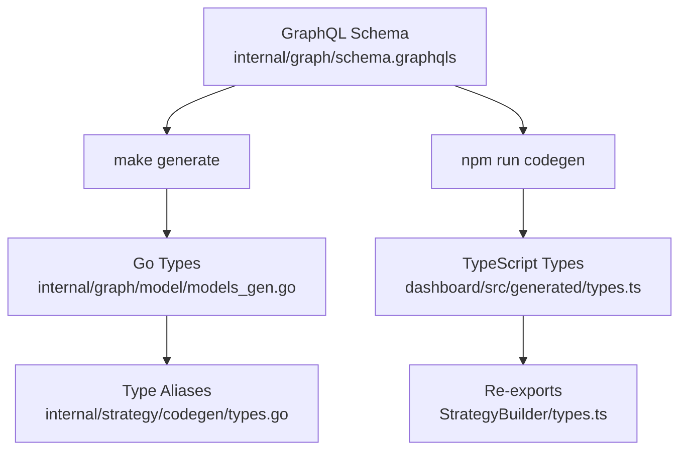

# VolatiCloud - Claude Code Reference

**This file contains Claude-specific notes and high-level project guidance.**
**For comprehensive documentation, see `/docs/` directory.**

## Git Rules for Claude

1. **Never add Claude advertising to commit messages**
   - No "🤖 Generated with Claude Code" footers
   - Keep commit messages professional and descriptive

2. **MANDATORY: Pre-commit checklist**
   - [ ] Run dashboard lint: `npm run lint`
   - [ ] Run dashboard TypeScript check: `npx tsc --noEmit`
   - [ ] Run backend tests: `go test ./...`
   - [ ] Run backend vet: `go vet ./...`
   - [ ] Run backend lint: `golangci-lint run ./...`
   - [ ] Update documentation if API or architecture changed
   - [ ] All checks must pass before committing

## Domain-Driven Design (DDD) - MANDATORY

**The `internal/graph/` package is a THIN LAYER - only GraphQL resolvers.**
**ALL business logic MUST be in domain packages under `internal/{domain}/`.**

### Critical Rules

1. ❌ **NO business logic in `internal/graph/`** - Resolvers only call domain functions
2. ❌ **NO domain packages import `internal/graph/`** - Prevents circular dependencies
3. ✅ **Each domain owns its logic** - Validation, spec building, lifecycle operations

### Domain Package Reference

| Package | Responsibility |
|---------|---------------|
| `alert` | Alerting system, notifications, email delivery |
| `authz` | Authorization, UMA resources |
| `bot` | Bot lifecycle, config validation |
| `backtest` | Backtest execution, result parsing |
| `organization` | Organization alias system, creation, soft delete |
| `strategy` | Strategy versioning |
| `strategy/codegen` | Strategy code generation from UI Builder |
| `exchange` | Exchange config validation |
| `billing` | Stripe integration, credits, subscriptions, enforcement |
| `db` | Database transactions |

See `internal/{package}/doc.go` for comprehensive package documentation.

### Code Pattern

```go
// ❌ WRONG - logic in resolver
func (r *mutationResolver) CreateBot(...) {
    if config["stake_amount"] == nil { return nil, err }  // NO!
}

// ✅ CORRECT - logic in domain package
// internal/bot/config.go
func ValidateConfig(config map[string]interface{}) error { ... }

// internal/graph/schema.resolvers.go
func (r *mutationResolver) CreateBot(...) {
    if err := bot.ValidateConfig(input.Config); err != nil { return nil, err }
}
```

### Code Review Checklist

- [ ] No business logic in `internal/graph/` resolvers
- [ ] New logic is in appropriate domain package
- [ ] Domain package has no `internal/graph/` imports
- [ ] Functions are exported and documented

## Architecture Documentation

**All architectural decisions are documented in ADRs (Architecture Decision Records):**

See `/docs/adr/README.md` for complete index.

**Key ADRs:**

- [ADR-0001](../docs/adr/0001-context-based-dependency-injection.md) - Context-Based DI (gqlgen integration)
- [ADR-0002](../docs/adr/0002-ent-orm-with-graphql.md) - ENT ORM + GraphQL Integration
- [ADR-0003](../docs/adr/0003-strategy-immutable-versioning.md) - Strategy Immutable Versioning
- [ADR-0004](../docs/adr/0004-runtime-abstraction-layer.md) - Runtime Abstraction (Docker/K8s)
- [ADR-0005](../docs/adr/0005-per-component-graphql-codegen.md) - Per-Component GraphQL Codegen
- [ADR-0006](../docs/adr/0006-bot-config-layer-separation.md) - Bot Config Layer Separation
- [ADR-0007](../docs/adr/0007-kubernetes-deployment-strategy.md) - Kubernetes Deployment
- [ADR-0008](../docs/adr/0008-multi-tenant-authorization.md) - Multi-Tenant Authorization (UMA 2.0, public/private visibility)
- [ADR-0011](../docs/adr/0011-strategy-ui-builder.md) - Strategy UI Builder Architecture
- [ADR-0012](../docs/adr/0012-organization-alias-system.md) - Organization Alias System
- [ADR-0013](../docs/adr/0013-long-short-signal-support.md) - Long/Short Signal Support with Mirror
- [ADR-0017](../docs/adr/0017-hybrid-testing-strategy.md) - Hybrid Testing Strategy (mocks + testcontainers)
- [ADR-0018](../docs/adr/0018-graphql-websocket-subscriptions.md) - GraphQL WebSocket Subscriptions (real-time updates)
- [ADR-0019](../docs/adr/0019-internal-backend-architecture.md) - Internal Backend Architecture (no external API ingress)

## Project Structure

```
internal/
├── alert/         # Alerting system → See doc.go
├── auth/          # JWT authentication, middleware
├── authz/         # UMA authorization hooks → See doc.go
├── backtest/      # Backtest domain → See doc.go
├── bot/           # Bot domain → See doc.go
├── db/            # Database utilities
├── ent/           # ENT ORM schemas
├── enum/          # Custom enums (including alert enums)
├── exchange/      # Exchange domain
├── freqtrade/     # Generated API client
├── graph/         # GraphQL resolvers (THIN) → See doc.go
├── keycloak/      # Keycloak UMA client → See doc.go
├── monitor/       # Bot/backtest monitoring → See doc.go
├── organization/  # Organization alias system → See doc.go
├── pubsub/        # Pub/sub messaging for GraphQL subscriptions → See doc.go
├── runner/        # Container orchestration → See doc.go
├── strategy/      # Strategy versioning
└── utils/         # Shared utilities
```

**Package Documentation:** Each package has comprehensive `doc.go` files with Mermaid diagrams (not ASCII art) and usage examples.

## Quick Commands

```bash
# Development
make generate     # Regenerate all (ENT + GraphQL + Freqtrade)
make build        # Build binary
make test         # Run tests with coverage
make test-integration  # Run integration tests with real Keycloak (requires Docker)
make test-all     # Run all tests (unit + integration)
make dev          # Run development server

# Documentation
make docs-generate  # Generate ERD + dependency diagrams
make docs-verify    # Verify documentation structure

# Database
# Migrations run automatically on server start (no manual command needed)
make db-reset     # Reset database

# Dashboard
cd dashboard && npm run codegen && npm run dev
```

## Critical Implementation Notes

### Strategy Versioning

⚠️ **Strategy has one-to-one relationship with Backtest**

```go
// ✅ CORRECT - Use singular edge
existingStrategy, _ := r.client.Strategy.Query().
    Where(strategy.ID(strategyID)).
    WithBacktest().  // SINGULAR - one-to-one relationship
    Only(ctx)

if existingStrategy.Edges.Backtest != nil {
    // Strategy already has a backtest
}
```

See [ADR-0003](../docs/adr/0003-strategy-immutable-versioning.md) for full details.

### GraphQL Code Generation

**Backend:**

```bash
make generate  # Runs: ENT generation → GraphQL schema generation → gqlgen
```

**OpenAPI Generator Docker Image:**

If CI fails with "Generated code is out of date" after running `make generate` locally:

```bash
# Pull latest OpenAPI generator Docker image
docker pull openapitools/openapi-generator-cli:latest

# Regenerate Freqtrade client
make generate-freqtrade

# Commit any changes
git add internal/freqtrade/
git commit -m "fix: update generated Freqtrade client"
```

**Note:** The Makefile uses `openapitools/openapi-generator-cli:latest` which can cause
inconsistent code generation between local and CI environments. Consider pinning to a specific
version if this becomes a recurring issue.

**Frontend:**

```bash
# Generate TypeScript types (reads local schema files - no server needed)
cd dashboard && npm run codegen
```

See [ADR-0005](../docs/adr/0005-per-component-graphql-codegen.md) for architecture.

### Type Synchronization (GraphQL as Single Source of Truth)

**Strategy UI Builder types are defined in GraphQL schema and generated for both Go and TypeScript.**



**To add/modify UI Builder enums:**

1. Edit `internal/graph/schema.graphqls` (add enum)
2. Run `make generate` (generates Go types)
3. Run `cd dashboard && npm run codegen` (generates TypeScript types)
4. Update type aliases in `codegen/types.go` if needed
5. Update re-exports in `StrategyBuilder/types.ts` if needed

**Key enums defined in GraphQL:**

- `ConditionNodeType` - AND, OR, NOT, COMPARE, CROSSOVER, etc.
- `OperandType` - CONSTANT, INDICATOR, PRICE, TRADE_CONTEXT, etc.
- `ComparisonOperator` - eq, neq, gt, gte, lt, lte, in, not_in
- `IndicatorType` - RSI, SMA, EMA, MACD, BB, ATR, etc.

See `internal/strategy/doc.go` for detailed type synchronization documentation.

### Authentication & Authorization

**Keycloak is MANDATORY** - Server won't start without proper configuration.

**Required Environment Variables:**

```bash
VOLATICLOUD_KEYCLOAK_URL=https://keycloak.volaticloud.com
VOLATICLOUD_KEYCLOAK_REALM=volaticloud
VOLATICLOUD_KEYCLOAK_CLIENT_ID=volaticloud-api
VOLATICLOUD_KEYCLOAK_CLIENT_SECRET=<secret>
```

**Multi-Entity Authorization:**

- Strategy, Bot, Exchange, BotRunner all have UMA 2.0 resource management
- GraphQL directives: `@isAuthenticated`, `@hasScope(resourceArg: "id", scope: "edit")`
- Database-first approach with transaction rollback on Keycloak failure

**Public/Private Visibility:**

- Resources have `public` boolean field (default: false)
- Public resources visible to all authenticated users
- Sensitive fields protected by `view-secrets` scope (API keys, credentials)
- Use `setStrategyVisibility`, `setBotVisibility`, `setRunnerVisibility` mutations

**View-Secrets Scope:**

- `view` scope: basic resource info (id, name, status)
- `view-secrets` scope: sensitive config (Bot.config, Exchange.config, BotRunner.config)
- Dashboard uses lazy queries to fetch secrets only when editing

**Organization Permission Scopes:**

Organization-level scopes control what users can do within an organization:

- `create-strategy` - Create new strategies in the organization
- `create-bot` - Create new bots in the organization
- `create-exchange` - Create new exchange connections
- `create-runner` - Create new bot runners
- `view-users` - View organization members
- `invite-user` - Invite new users to the organization
- `change-user-roles` - Modify user roles within the organization

The `@hasScope` directive uses `resourceType: ORGANIZATION` for these scopes to enable O(1) permission lookups.

See `internal/keycloak/doc.go` and `internal/authz/doc.go` for details.

### Testing

**Coverage:** 91.9% (excluding generated code)

```bash
make test              # Run unit tests (fast, no Docker required)
make test-integration  # Run integration tests (requires Docker)
make test-all          # Run all tests
make coverage          # Open HTML coverage report
```

**Hybrid Testing Strategy** (see [ADR-0017](../docs/adr/0017-hybrid-testing-strategy.md)):

- **Unit tests** use mocks (`MockAdminClient`, `MockUMAClient`) for fast execution
- **Integration tests** use testcontainers with real Keycloak for high fidelity
- Build tag `//go:build integration` separates integration tests

**Test files follow pattern:**

- `internal/{package}/*_test.go` - Unit tests (with mocks)
- `internal/{package}/integration_test.go` - Integration tests (with `//go:build integration`)
- Uses table-driven tests for multiple scenarios
- 100% coverage goal for business logic

## Documentation Index

**📚 Meta-Documentation:**

- **`/docs/DOCUMENTATION_GUIDE.md`** - Complete guide to creating, maintaining, and verifying documentation

**Primary Documentation:**

- `/docs/adr/` - Architecture Decision Records
- `/docs/patterns/` - Reusable code patterns
- `/docs/runbooks/` - Operational guides
- `/docs/diagrams/` - Auto-generated ERD and dependency graphs
- `/docs/api/graphql/` - GraphQL API documentation
- `/deployments/backend/` - Kubernetes deployment guide

**Package Documentation:**

- `internal/alert/doc.go` - Alerting system, notifications, email delivery
- `internal/authz/doc.go` - Authorization scopes and resource types
- `internal/monitor/doc.go` - Bot/backtest monitoring architecture
- `internal/runner/doc.go` - Runtime abstraction (Docker/K8s)
- `internal/graph/doc.go` - GraphQL resolver architecture
- `internal/backtest/doc.go` - Backtest result parsing
- `internal/keycloak/doc.go` - Keycloak UMA 2.0 integration
- `internal/organization/doc.go` - Organization alias system, dual identifiers
- `internal/strategy/doc.go` - Strategy modes, versioning, type synchronization
- `internal/strategy/codegen/doc.go` - Strategy code generation from UI Builder

**Generated Documentation:**

```bash
make docs-generate  # Generate all diagrams
make docs-verify    # Validate documentation
```

## Key Configuration Files

- `gqlgen.yml` - GraphQL code generation config
- `internal/ent/entc.go` - ENT GraphQL extension config
- `Makefile` - Build and documentation commands
- `deployments/backend/values.yaml` - Kubernetes deployment config

## Troubleshooting

**Common Issues:**

1. **GraphQL schema errors** → Run `make generate` to regenerate
2. **"Keycloak configuration required"** → Set all env vars above
3. **Dashboard codegen fails** → Ensure backend server is running first
4. **Test failures** → Check `make test` output, review test coverage

**Debug Commands:**

```bash
# View logs
kubectl logs -n volaticloud -l app=volaticloud-backend --tail=100

# Check health
curl http://localhost:8080/health

# Verify Keycloak
curl https://keycloak.volaticloud.com/auth/realms/volaticloud/.well-known/openid-configuration
```

---

**For detailed documentation, always refer to `/docs/` directory first.**
