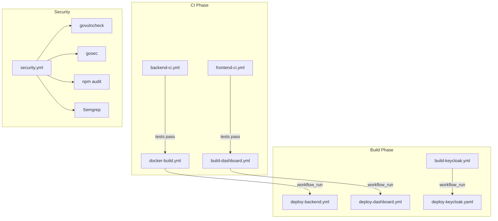

# GitHub Actions CI/CD

This directory contains GitHub Actions workflows for VolatiCloud CI/CD.

## Architecture

See [ADR-0009: GitHub Actions Architecture](../docs/adr/0009-github-actions-architecture.md) for design decisions.

## Workflow Overview



## Directory Structure

```
.github/
├── actions/                      # Composite Actions
│   ├── setup-go/                 # Go environment setup
│   ├── setup-node/               # Node.js environment setup
│   ├── setup-kubectl-helm/       # Kubernetes tooling
│   └── coverage-filter/          # Coverage report filtering
│
├── workflows/
│   ├── _ci-go.yml                # Reusable: Go CI pipeline
│   ├── _ci-node.yml              # Reusable: Node CI pipeline
│   ├── _docker-build.yml         # Reusable: Docker build & push
│   ├── _helm-deploy.yml          # Reusable: Helm deployment
│   ├── _security-scan.yml        # Reusable: Security scanning
│   │
│   ├── backend-ci.yml            # Go backend CI
│   ├── frontend-ci.yml           # Dashboard CI
│   ├── docker-build.yml          # Backend Docker image
│   ├── build-dashboard.yml       # Dashboard Docker image
│   ├── build-keycloak.yml        # Keycloak Docker image
│   ├── deploy-backend.yml        # Backend K8s deployment
│   ├── deploy-dashboard.yml      # Dashboard K8s deployment
│   ├── quality.yml               # PR coverage reports
│   └── security.yml              # Security scanning
│
└── README.md                     # This file
```

## Naming Conventions

| Type | Pattern | Example |
|------|---------|---------|
| Reusable Workflow | `_<name>.yml` | `_ci-go.yml` |
| Composite Action | `actions/<name>/action.yml` | `actions/setup-go/action.yml` |
| Caller Workflow | `<name>.yml` | `backend-ci.yml` |

## Triggers

| Workflow | Trigger |
|----------|---------|
| `backend-ci` | Push/PR on `main` (Go files) |
| `frontend-ci` | Push/PR on `main` (dashboard/) |
| `docker-build` | Push/PR on `main` (Go/Dockerfile) |
| `deploy-*` | `workflow_run` after build completes |
| `security` | Push/PR + Weekly schedule |
| `quality` | PR only |

## Manual Deployment

```bash
# Deploy specific image tag
gh workflow run deploy-backend.yml -f image_tag=abc1234

# Deploy latest
gh workflow run deploy-backend.yml
```

## Required Secrets

| Secret | Description |
|--------|-------------|
| `VKE_KUBECONFIG` | Base64-encoded kubeconfig for VKE |
| `GHCR_TOKEN` | GitHub token for image pull |
| `VOLATICLOUD_DATABASE` | Database connection string |

## Security Scanning

The `security.yml` workflow runs free, open-source security tools:

- **govulncheck**: Go vulnerability scanning (CVEs)
- **gosec**: Go security linter (code patterns)
- **npm audit**: Node.js dependency audit
- **Semgrep**: Multi-language SAST analysis

Schedule: Every Monday 9 AM UTC + on every PR/push

## Troubleshooting

### Workflow not triggering

Check path filters in the workflow file match your changed files.

### Deploy fails with "cluster unreachable"

Verify `VKE_KUBECONFIG` secret is valid and not expired.

### Coverage filter not working

Ensure `coverage.out` exists before the filter step runs.

## References

- [GitHub Actions Documentation](https://docs.github.com/en/actions)
- [ADR-0009: GitHub Actions Architecture](../docs/adr/0009-github-actions-architecture.md)
- [ADR-0007: Kubernetes Deployment Strategy](../docs/adr/0007-kubernetes-deployment-strategy.md)
