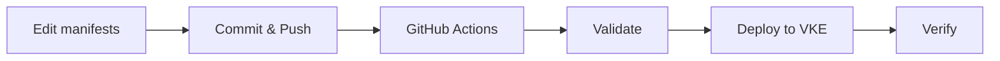

# VolatiCloud Kubernetes Deployments

This directory contains all Kubernetes manifests and configurations for deploying VolatiCloud infrastructure on VKE (Vultr Kubernetes Engine).

## Directory Structure

```
deployments/
├── olm/              # Operator Lifecycle Manager installation
│   ├── install.sh   # OLM installation script
│   ├── values.yaml  # OLM configuration
│   └── README.md
│
├── keycloak/        # Keycloak authentication infrastructure
│   ├── namespace.yaml
│   ├── operator-subscription.yaml
│   ├── keycloak-instance.yaml
│   ├── keycloak-realm.yaml
│   ├── keycloak-client.yaml
│   └── README.md
│
├── prometheus/      # Prometheus monitoring stack
│   ├── namespace.yaml
│   ├── operator-subscription.yaml
│   ├── prometheus-instance.yaml
│   ├── servicemonitors.yaml
│   ├── prometheus-ingress.yaml
│   └── README.md
│
└── README.md        # This file
```

## Overview

The deployment is structured in layers:

1. **OLM Layer**: Operator Lifecycle Manager for managing Kubernetes operators
2. **Authentication Layer**: Keycloak for OIDC/OAuth2 authentication
3. **Monitoring Layer**: Prometheus for container metrics collection
4. **Application Layer**: VolatiCloud application (Helm chart)

## GitOps Workflow

All deployments are automated via GitHub Actions. Changes committed to this directory automatically trigger deployments.



## Prerequisites

### 1. VKE Cluster

Create a Kubernetes cluster on Vultr:

- **Nodes**: 2-4 nodes (depending on environment)
- **Node Size**: At least 2 vCPU, 4GB RAM per node
- **Region**: Choose appropriate region
- **Version**: Latest stable Kubernetes version

### 2. Managed PostgreSQL

Create a managed PostgreSQL database on Vultr for Keycloak:

- **Database Name**: `keycloak`
- **User**: `keycloak`
- **Version**: PostgreSQL 14+

Create the database:

```sql
CREATE DATABASE keycloak;
GRANT ALL PRIVILEGES ON DATABASE keycloak TO keycloak;
```

### 3. Domain Configuration

Set up DNS records:

- `auth.yourdomain.com` → Keycloak (A record pointing to VKE load balancer)
- `yourdomain.com` → VolatiCloud application

### 4. GitHub Secrets

Configure the following secrets in your GitHub repository settings (**Settings → Secrets and variables → Actions → New repository secret**):

#### Required Secrets

| Secret Name | Description | Example |
|------------|-------------|---------|
| `VKE_KUBECONFIG` | Base64-encoded kubeconfig file | `echo "$(cat kubeconfig.yaml)" \| base64` |
| `KEYCLOAK_DB_HOST` | PostgreSQL hostname:port | `postgres-abc123.vultr.com:5432` |
| `KEYCLOAK_DB_USERNAME` | PostgreSQL username | `keycloak` |
| `KEYCLOAK_DB_PASSWORD` | PostgreSQL password | `your-secure-password` |
| `KEYCLOAK_HOSTNAME` | Keycloak public hostname | `auth.yourdomain.com` |
| `VOLATICLOUD_URL` | VolatiCloud application URL | `https://yourdomain.com` |

#### How to Get VKE_KUBECONFIG

1. Download kubeconfig from Vultr dashboard
2. Base64 encode it:

   ```bash
   cat vke-kubeconfig.yaml | base64
   ```

3. Copy the output and paste it as the secret value

## Deployment Order

### First-Time Setup

1. **Install OLM** (one-time):

   ```bash
   # Via GitHub Actions
   gh workflow run deploy-keycloak.yaml

   # Or manually
   cd deployments/olm
   ./install.sh
   ```

2. **Deploy Keycloak** (automatic after OLM):

   ```bash
   # Commit Keycloak configuration
   git add deployments/keycloak/
   git commit -m "feat: deploy Keycloak"
   git push origin main

   # GitHub Actions automatically deploys
   ```

3. **Verify Deployment**:

   ```bash
   # Check OLM
   kubectl get csv -n olm

   # Check Keycloak
   kubectl get keycloak -n keycloak
   kubectl get pods -n keycloak
   ```

### Updating Configuration

1. Edit manifest files in this directory
2. Commit and push to `main` branch
3. GitHub Actions automatically validates and deploys
4. Verify deployment in GitHub Actions UI

## Workflows

### deploy-keycloak.yaml

**Triggers**:

- Push to `main` branch with changes in `deployments/olm/**` or `deployments/keycloak/**`
- Manual trigger via `gh workflow run deploy-keycloak.yaml`
- Pull requests (validation only)

**Jobs**:

1. **Validate**: Lint and validate all manifests
2. **Install OLM**: Install OLM if not present (skips if already installed)
3. **Deploy Keycloak**: Deploy Keycloak operator and instance

**Duration**: ~10-15 minutes (first time), ~3-5 minutes (updates)

### deploy-prometheus.yaml

**Triggers**:

- Push to `main` branch with changes in `deployments/prometheus/**`
- Manual trigger via `gh workflow run deploy-prometheus.yaml`

**Jobs**:

1. **Validate**: Lint and validate all manifests
2. **Check OLM**: Verify OLM is installed (required)
3. **Deploy Prometheus**: Deploy Prometheus operator, instance, and ServiceMonitors

**Duration**: ~5-10 minutes (first time), ~2-3 minutes (updates)

## Verification

### Check OLM

```bash
# Check OLM installation
kubectl get pods -n olm

# Expected output:
# NAME                                READY   STATUS    RESTARTS   AGE
# olm-operator-xxxxx                  1/1     Running   0          10m
# catalog-operator-xxxxx              1/1     Running   0          10m
# operatorhubio-catalog-xxxxx         1/1     Running   0          10m
```

### Check Keycloak

```bash
# Check Keycloak instance
kubectl get keycloak -n keycloak

# Check Keycloak pods
kubectl get pods -n keycloak

# Check Keycloak service
kubectl get svc -n keycloak

# Check Keycloak ingress (if configured)
kubectl get ingress -n keycloak
```

### Check Prometheus

```bash
# Check Prometheus instance
kubectl get prometheus -n monitoring

# Check Prometheus pods
kubectl get pods -n monitoring

# Check ServiceMonitors
kubectl get servicemonitor -n monitoring

# Access Prometheus UI (port-forward)
kubectl port-forward -n monitoring svc/prometheus-operated 9090:9090
# Open http://localhost:9090
```

### Access Keycloak

1. Get admin credentials:

   ```bash
   kubectl get secret volaticloud-keycloak-initial-admin \
     -n keycloak -o jsonpath='{.data.username}' | base64 -d
   kubectl get secret volaticloud-keycloak-initial-admin \
     -n keycloak -o jsonpath='{.data.password}' | base64 -d
   ```

2. Access admin console:

   ```
   https://auth.yourdomain.com/auth/admin
   ```

3. Test OIDC configuration:

   ```
   https://auth.yourdomain.com/auth/realms/volaticloud/.well-known/openid-configuration
   ```

## Common Operations

### View Deployment Status

```bash
# Via GitHub CLI
gh run list --workflow=deploy-keycloak.yaml

# View latest run
gh run view --log

# Watch run in real-time
gh run watch
```

### Trigger Manual Deployment

```bash
# Deploy everything
gh workflow run deploy-keycloak.yaml

# Skip OLM installation (if already installed)
gh workflow run deploy-keycloak.yaml -f skip-olm=true
```

### View Logs

```bash
# Keycloak operator logs
kubectl logs -n keycloak -l control-plane=controller-manager --tail=100

# Keycloak instance logs
kubectl logs -n keycloak -l app=keycloak --tail=100

# Follow logs
kubectl logs -n keycloak -l app=keycloak -f
```

### Restart Keycloak

```bash
# Restart all Keycloak pods
kubectl rollout restart statefulset/volaticloud-keycloak -n keycloak

# Watch rollout status
kubectl rollout status statefulset/volaticloud-keycloak -n keycloak
```

## Troubleshooting

### Workflow Fails at OLM Installation

**Issue**: OLM installation times out or fails

**Solution**:

```bash
# Check OLM namespace exists
kubectl get namespace olm

# Manual cleanup and reinstall
kubectl delete namespace olm
cd deployments/olm
./install.sh
```

### Workflow Fails at Keycloak Deployment

**Issue**: Keycloak operator not installing

**Solution**:

```bash
# Check subscription status
kubectl describe subscription keycloak-operator -n keycloak

# Check catalog source
kubectl get catalogsource -n olm

# Delete and recreate subscription
kubectl delete subscription keycloak-operator -n keycloak
kubectl apply -f deployments/keycloak/operator-subscription.yaml
```

### Keycloak Pods Not Starting

**Issue**: Database connection problems

**Solution**:

```bash
# Check database secret
kubectl get secret keycloak-db-secret -n keycloak

# Verify credentials
kubectl get secret keycloak-db-secret -n keycloak -o yaml

# Test database connectivity from cluster
kubectl run -it --rm psql-test --image=postgres:14 --restart=Never -- \
  psql -h <KEYCLOAK_DB_HOST> -U keycloak -d keycloak
```

### GitHub Actions Secret Issues

**Issue**: Workflow fails with "secret not found"

**Solution**:

1. Verify secrets are configured: **Settings → Secrets and variables → Actions**
2. Check secret names match exactly (case-sensitive)
3. Re-encode kubeconfig if kubectl commands fail

## Security Best Practices

1. **Never commit secrets**: All secrets go in GitHub Secrets
2. **Use HTTPS**: Always access Keycloak over HTTPS
3. **Strong passwords**: Use strong, randomly generated passwords
4. **Regular updates**: Keep operators and Keycloak updated
5. **Access control**: Limit who can approve production deployments
6. **Audit logs**: Enable audit logging in Keycloak

## Monitoring

### GitHub Actions

- View workflow runs: https://github.com/volaticloud/volaticloud/actions
- Deployment history visible in Actions tab
- Failed deployments send notifications

### Kubernetes

```bash
# Resource usage
kubectl top nodes
kubectl top pods -n keycloak

# Events
kubectl get events -n keycloak --sort-by='.lastTimestamp'

# Resource status
kubectl get all -n keycloak
```

## Next Steps

After infrastructure is deployed:

1. **Create Users**: Access Keycloak admin console and create users
2. **Assign Roles**: Assign appropriate roles (admin, trader, viewer)
3. **Test Authentication**: Test OIDC login flow
4. **Deploy Prometheus**: Deploy monitoring stack for container metrics
5. **Deploy Application**: Deploy VolatiCloud application
6. **Configure Runner**: Add Prometheus URL to Kubernetes runner config

## References

- [VKE Documentation](https://www.vultr.com/docs/vultr-kubernetes-engine/)
- [OLM Documentation](https://olm.operatorframework.io/)
- [Keycloak Operator](https://www.keycloak.org/operator/installation)
- [Prometheus Operator](https://prometheus-operator.dev/)
- [GitHub Actions](https://docs.github.com/en/actions)

## Support

For issues or questions:

1. Check troubleshooting section above
2. Review logs: `kubectl logs -n keycloak -l app=keycloak`
3. Check GitHub Actions workflow output
4. Open GitHub issue with details
