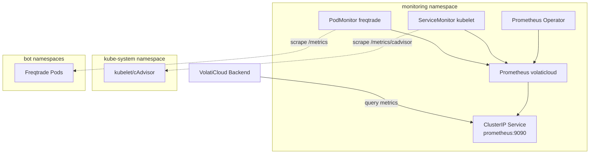
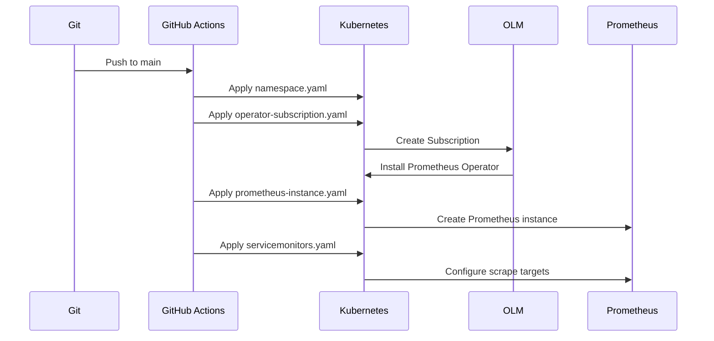
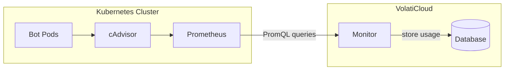

# Prometheus Deployment

GitOps deployment for Prometheus monitoring stack on Kubernetes.

## Overview

This deployment provides:

- **Prometheus Operator** via OLM for managing Prometheus instances
- **Prometheus Instance** for collecting and storing metrics
- **ServiceMonitors** for scraping kubelet/cAdvisor container metrics
- **PodMonitors** for scraping Freqtrade bot metrics (if exposed)

## Architecture



## Files

| File | Description |
|------|-------------|
| `namespace.yaml` | Creates `monitoring` namespace |
| `operator-subscription.yaml` | OLM subscription for Prometheus Operator |
| `prometheus-instance.yaml` | Prometheus CR, RBAC, and Service |
| `servicemonitors.yaml` | ServiceMonitor for kubelet/cAdvisor metrics |
| `prometheus-ingress.yaml` | Optional ingress for external access |

## Deployment Flow



## Prerequisites

1. **OLM Installed**: Operator Lifecycle Manager must be running

   ```bash
   kubectl get pods -n olm
   ```

2. **cert-manager** (optional): For TLS ingress

   ```bash
   kubectl get pods -n cert-manager
   ```

## Deployment

### Via GitHub Actions (Recommended)

Commit changes to `main` branch - GitHub Actions will automatically deploy:

```bash
git add deployments/prometheus/
git commit -m "feat: deploy Prometheus monitoring"
git push origin main
```

### Manual Deployment

```bash
# 1. Create namespace
kubectl apply -f deployments/prometheus/namespace.yaml

# 2. Install Prometheus Operator via OLM
kubectl apply -f deployments/prometheus/operator-subscription.yaml

# 3. Wait for operator to be ready
kubectl wait --for=condition=Ready pod -l app.kubernetes.io/name=prometheus-operator \
  -n monitoring --timeout=300s

# 4. Deploy Prometheus instance and monitors
kubectl apply -f deployments/prometheus/prometheus-instance.yaml
kubectl apply -f deployments/prometheus/servicemonitors.yaml

# 5. (Optional) Deploy ingress for external access
kubectl apply -f deployments/prometheus/prometheus-ingress.yaml
```

## Verification

```bash
# Check operator status
kubectl get csv -n monitoring

# Check Prometheus instance
kubectl get prometheus -n monitoring

# Check pods
kubectl get pods -n monitoring

# Check service
kubectl get svc -n monitoring

# Check ServiceMonitors
kubectl get servicemonitor -n monitoring

# Check targets (port-forward to access UI)
kubectl port-forward -n monitoring svc/prometheus-operated 9090:9090
# Open http://localhost:9090/targets
```

## Configuration

### Prometheus URL for VolatiCloud

After deployment, configure the runner with the Prometheus URL:

**In-cluster (recommended):**

```text
http://prometheus-operated.monitoring.svc.cluster.local:9090
```

**Via Ingress (if configured):**

```text
https://prometheus.volaticloud.com
```

### Storage

By default, Prometheus uses `emptyDir` (ephemeral storage). For persistent storage, uncomment the storage section in `prometheus-instance.yaml`:

```yaml
storage:
  volumeClaimTemplate:
    spec:
      accessModes: ["ReadWriteOnce"]
      resources:
        requests:
          storage: 10Gi
      storageClassName: vultr-block-storage
```

### Retention

Default retention is 7 days. Modify in `prometheus-instance.yaml`:

```yaml
retention: 7d    # Metrics retention period
```

### Resources

Default resource limits:

| Resource | Request | Limit |
|----------|---------|-------|
| CPU | 200m | 500m |
| Memory | 512Mi | 1Gi |

Adjust based on cluster size and metric volume.

## Collected Metrics

### cAdvisor Metrics (Container Resources)

| Metric | Description |
|--------|-------------|
| `container_cpu_usage_seconds_total` | CPU usage in seconds |
| `container_memory_usage_bytes` | Memory usage in bytes |
| `container_memory_working_set_bytes` | Working set memory |
| `container_network_receive_bytes_total` | Network bytes received |
| `container_network_transmit_bytes_total` | Network bytes transmitted |
| `container_fs_reads_bytes_total` | Disk read bytes |
| `container_fs_writes_bytes_total` | Disk write bytes |

### Example Queries

**CPU usage per container:**

```promql
sum(rate(container_cpu_usage_seconds_total{container!=""}[5m])) by (pod, container)
```

**Memory usage per pod:**

```promql
sum(container_memory_working_set_bytes{container!=""}) by (pod)
```

**Network I/O per pod:**

```promql
sum(rate(container_network_receive_bytes_total[5m])) by (pod)
sum(rate(container_network_transmit_bytes_total[5m])) by (pod)
```

**Disk I/O per pod:**

```promql
sum(rate(container_fs_reads_bytes_total[5m])) by (pod)
sum(rate(container_fs_writes_bytes_total[5m])) by (pod)
```

## VolatiCloud Integration

### Usage Tracking Flow



VolatiCloud uses Prometheus to collect billing metrics for bots and backtests:

1. **CPU Usage**: Calculated from `container_cpu_usage_seconds_total`
2. **Memory Usage**: Calculated from `container_memory_working_set_bytes`
3. **Network I/O**: Calculated from `container_network_*_bytes_total`
4. **Disk I/O**: Calculated from `container_fs_*_bytes_total`

### Configuration in Runner

When creating a Kubernetes runner, set the Prometheus URL:

```json
{
  "namespace": "volaticloud-public",
  "prometheusUrl": "http://prometheus-operated.monitoring.svc.cluster.local:9090"
}
```

## Security

### Internal Access Only (Default)

By default, Prometheus is only accessible within the cluster via ClusterIP service.

### External Access (Optional)

If external access is needed:

1. **Create basic auth secret:**

   ```bash
   htpasswd -c auth prometheus
   kubectl create secret generic prometheus-basic-auth \
     --from-file=auth -n monitoring
   ```

2. **Enable in ingress:**
   Uncomment auth annotations in `prometheus-ingress.yaml`

3. **Apply ingress:**

   ```bash
   kubectl apply -f deployments/prometheus/prometheus-ingress.yaml
   ```

## Troubleshooting

### Operator Not Installing

```bash
# Check subscription status
kubectl describe subscription prometheus-operator -n monitoring

# Check catalog source
kubectl get catalogsource -n olm

# Check operator pods
kubectl get pods -n monitoring -l app.kubernetes.io/name=prometheus-operator
```

### No Metrics in Prometheus

```bash
# Check targets
kubectl port-forward -n monitoring svc/prometheus-operated 9090:9090
# Open http://localhost:9090/targets

# Check ServiceMonitor
kubectl describe servicemonitor kubelet -n monitoring

# Check Prometheus logs
kubectl logs -n monitoring -l app.kubernetes.io/name=prometheus --tail=100
```

### RBAC Issues

```bash
# Verify ClusterRole exists
kubectl get clusterrole prometheus-volaticloud

# Verify ClusterRoleBinding exists
kubectl get clusterrolebinding prometheus-volaticloud

# Check service account
kubectl get sa prometheus-volaticloud -n monitoring
```

## Cleanup

```bash
# Delete all Prometheus resources
kubectl delete -f deployments/prometheus/

# Delete namespace (removes everything)
kubectl delete namespace monitoring

# Remove OLM subscription
kubectl delete subscription prometheus-operator -n monitoring
```

## References

- [Prometheus Operator](https://prometheus-operator.dev/)
- [OLM Documentation](https://olm.operatorframework.io/)
- [cAdvisor Metrics](https://github.com/google/cadvisor/blob/master/docs/storage/prometheus.md)
- [PromQL Basics](https://prometheus.io/docs/prometheus/latest/querying/basics/)
