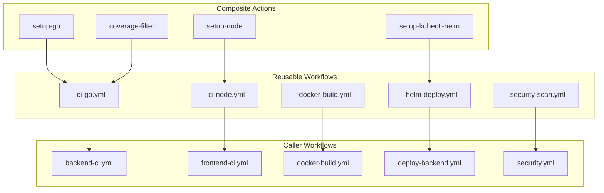
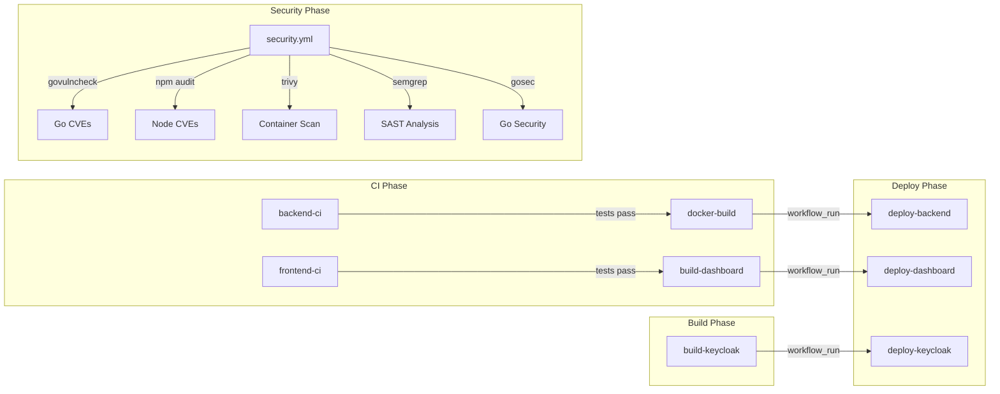

# 0009. GitHub Actions CI/CD Architecture

Date: 2025-12-01

## Status

Accepted

## Context and Problem Statement

VolatiCloud has 12+ GitHub Actions workflows covering CI, Docker builds, Kubernetes deployments, and quality checks. Current issues:

1. **Code Duplication**: Same setup steps and patterns repeated across workflows
2. **Inconsistent Patterns**: Image tagging, artifact retention, and push behavior varies
3. **No Reusable Components**: Each workflow is standalone
4. **Disabled Security**: Security scanning workflow disabled without documentation
5. **Missing Documentation**: No workflow dependency documentation

**The Problem:** How do we create a maintainable, consistent, and secure CI/CD architecture?

## Decision Drivers

- **DRY Principle**: Eliminate code duplication
- **Consistency**: Standard patterns across all workflows
- **Security**: Comprehensive vulnerability and SAST scanning
- **Maintainability**: Single source of truth for common patterns
- **Flexibility**: Support different configurations per workflow

## Considered Options

### Option 1: Keep Standalone Workflows

Each workflow remains independent and self-contained.

**Cons:** High duplication, inconsistent patterns, maintenance burden.

### Option 2: Reusable Workflows Only

Create reusable workflows for all common patterns.

**Cons:** Cannot use matrix strategies, cannot add steps around calls, heavier for simple tasks.

### Option 3: Composite Actions Only

Create composite actions for all shared logic.

**Cons:** Cannot contain jobs, secrets must be passed explicitly, harder to debug.

### Option 4: Hybrid Approach

Use **Composite Actions** for shared steps and **Reusable Workflows** for entire pipelines.

**Pros:** Best of both worlds - appropriate abstraction level for each use case.

## Decision Outcome

Chosen option: **Hybrid Approach**, because it provides the right abstraction level:

- **Composite Actions**: For shared steps within jobs (setup, utilities)
- **Reusable Workflows**: For standardized job pipelines (CI, deploy, security)

## Architecture

### Component Structure

### Workflow Dependency Graph

### Naming Conventions

| Type | Pattern | Example |
|------|---------|---------|
| Reusable Workflow | `_<name>.yml` | `_ci-go.yml` |
| Composite Action | `actions/<name>/action.yml` | `actions/setup-go/action.yml` |
| Caller Workflow | `<name>.yml` | `backend-ci.yml` |

### Security Scanning Strategy

Enable comprehensive security scanning with free, open-source tools:

| Tool | Purpose | Trigger |
|------|---------|---------|
| govulncheck | Go CVE scanning | Every PR + push |
| gosec | Go security linter | Every PR + push |
| npm audit | Node.js dependency audit | Every PR + push |
| Trivy | Container vulnerability scanning | After Docker build |
| Semgrep | SAST analysis (multi-language) | Weekly + PR |

### Configuration Standards

| Setting | Standard |
|---------|----------|
| Artifact retention (builds) | 7 days |
| Artifact retention (reports) | 30 days |
| Image tag (PR) | `pr-<number>` |
| Image tag (main) | `<short-sha>` |
| CI concurrency | Cancel in progress |
| Deploy concurrency | No cancel (atomic) |

## Consequences

**Positive:**

- ~60% reduction in duplicated code
- Consistent patterns enforced automatically
- Security scanning enabled by default
- Single source of truth for each pattern

**Negative:**

- Initial refactoring effort required
- Team must learn composite action / reusable workflow patterns

## Implementation

### Key Files to Create

1. **Composite Actions** (4 files in `.github/actions/`)
2. **Reusable Workflows** (5 files prefixed with `_`)
3. **Documentation** (`.github/README.md`)

### Key Files to Modify

1. All existing CI workflows → use reusable `_ci-*.yml`
2. All build workflows → use reusable `_docker-build.yml`
3. All deploy workflows → use reusable `_helm-deploy.yml`
4. `security.yml.disabled` → Replace with enabled `security.yml`

### Execution Order

1. Create composite actions (foundation)
2. Create reusable workflows (build on actions)
3. Refactor caller workflows one by one
4. Enable security scanning
5. Add documentation

## Validation

- All workflows follow naming conventions
- No duplicated setup logic across workflows
- Security workflow runs on schedule and PRs
- `.github/README.md` documents workflow dependencies

## References

- [GitHub Docs: Reusable Workflows](https://docs.github.com/en/actions/sharing-automations/reusing-workflows)
- [GitHub Docs: Composite Actions](https://docs.github.com/en/actions/sharing-automations/creating-actions/creating-a-composite-action)
- [Trivy GitHub Action](https://github.com/aquasecurity/trivy-action)
- [Gosec - Go Security Checker](https://github.com/securego/gosec)
- [Semgrep - Open Source SAST](https://semgrep.dev/)
- [ADR-0007: Kubernetes Deployment Strategy](./0007-kubernetes-deployment-strategy.md)
