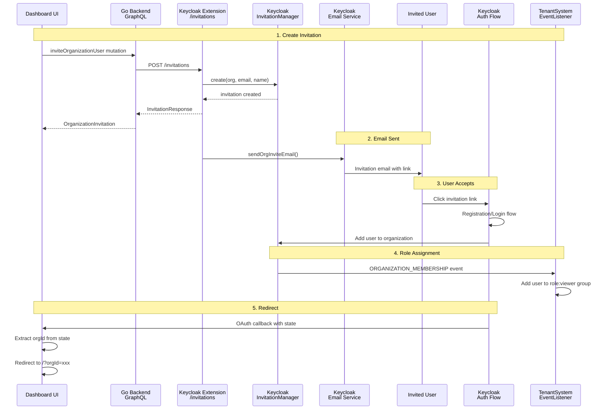

# 0010. Organization User Invitation System

Date: 2026-01-14

## Status

Accepted

## Context and Problem Statement

VolatiCloud needs a way for organization administrators to invite new users to their organizations. The invitation system must:

- Allow existing organization admins to invite users by email
- Support both new users (who need to register) and existing users
- Automatically assign appropriate permissions upon invitation acceptance
- Preserve organization context through the OAuth registration/login flow
- Integrate with the existing multi-tenant authorization system (ADR-0008)

**The Problem:** How do we implement user invitations that work seamlessly with Keycloak's authentication flow while maintaining security and proper role assignment?

## Decision Drivers

- **Native Keycloak integration**: Minimize custom code by using Keycloak 26's built-in invitation features
- **OAuth 2.0 compliance**: Properly handle the OAuth flow for invitation acceptance
- **Security**: Prevent open redirects, validate emails, and enforce proper authorization
- **User experience**: Seamless flow from invitation email to organization membership
- **Consistency**: Align with existing authorization model (ADR-0008)

## Considered Options

### Option 1: Custom Invitation Table

Store invitations in a custom database table, generate tokens manually, and handle acceptance in the Go backend.

**Pros:**

- Full control over invitation logic
- No Keycloak extension dependencies

**Cons:**

- Reinventing existing Keycloak functionality
- Must handle token expiration, email sending manually
- Separate from Keycloak's native organization membership
- More code to maintain

### Option 2: Keycloak Native InvitationManager (Chosen)

Use Keycloak 26's native `OrganizationProvider.getInvitationManager()` API combined with `InviteOrgActionToken` for invitation links.

**Pros:**

- Uses battle-tested Keycloak code
- Native organization membership management
- Built-in token expiration and validation
- Email templates and sending via Keycloak
- Integrates with Keycloak's authentication flows

**Cons:**

- Requires Keycloak extension (Java)
- Tighter coupling to Keycloak version
- Must handle OAuth state parameter for orgId preservation

### Option 3: Keycloak Admin API Only

Use Keycloak's Admin REST API to create organization invitations without custom extensions.

**Pros:**

- No Java extension code
- Standard REST API integration

**Cons:**

- Admin API doesn't provide invitation email sending
- Would need separate email service
- Limited customization of invitation flow

## Decision Outcome

Chosen option: **Keycloak Native InvitationManager**, because it:

1. Leverages Keycloak's proven invitation infrastructure
2. Integrates seamlessly with organization membership
3. Provides secure token-based invitation links
4. Handles email sending via Keycloak's email templates
5. Supports both new user registration and existing user login flows

### Consequences

**Positive:**

- Secure invitation links with automatic expiration
- Native Keycloak organization membership upon acceptance
- Event-driven role assignment via `TenantSystemEventListener`
- Standard OAuth flow with OIDC state parameter for context preservation
- Minimal custom code for core invitation logic

**Negative:**

- Java extension code required in Keycloak
- Must maintain compatibility with Keycloak version upgrades
- Complex OAuth callback handling for organization context preservation

**Neutral:**

- Invitation acceptance triggers existing event listener for role assignment
- Uses same group hierarchy as ADR-0008 for permissions

## Implementation

### Architecture Overview



### Key Files

- `keycloak/extensions/tenant-system/src/main/java/.../services/InvitationService.java` - Core invitation logic
- `keycloak/extensions/tenant-system/src/main/java/.../TenantSystemEventListener.java` - Auto-assigns viewer role
- `internal/graph/schema.resolvers.go:1042` - GraphQL mutation handler
- `internal/keycloak/admin_client.go:583` - Go client for Keycloak API
- `dashboard/src/config/keycloak.ts` - OIDC state parameter handling
- `dashboard/src/contexts/AuthContext.tsx` - Invitation callback detection
- `dashboard/src/components/Organization/InviteUserDialog.tsx` - UI component

### OAuth State Parameter Usage

The OIDC `state` parameter is used to preserve `orgId` through the OAuth flow:

```typescript
// dashboard/src/config/keycloak.ts
export function buildSigninState(): OAuthState | undefined {
  const urlParams = new URLSearchParams(window.location.search);
  const orgId = urlParams.get(ORG_ID_PARAM);
  if (orgId) {
    return { orgId };
  }
  return undefined;
}

// Usage in signinRedirect
auth.signinRedirect({ state: buildSigninState() });

// Recovery in onSigninCallback
onSigninCallback: (user: User | void) => {
  const state = user ? (user.state as OAuthState | undefined) : undefined;
  const orgId = state?.orgId;
  // Redirect to /?orgId=xxx
}
```

### Authorization Scope

New scope added to `GroupScopes` in `internal/authz/scopes.go`:

```go
var GroupScopes = []string{
    "view", "edit", "delete", "mark-alert-as-read", "view-users",
    "invite-user",  // NEW: Permission to invite users to organization
    "create-alert-rule", "update-alert-rule", "delete-alert-rule", "view-alert-rules",
}
```

GraphQL directive usage:

```graphql
extend type Mutation {
  inviteOrganizationUser(
    organizationId: ID! @hasScope(resource: "organizationId", scope: "invite-user")
    input: InviteUserInput!
  ): OrganizationInvitation!
}
```

### Security Measures

1. **Email Validation**: Server-side regex validation in both Java and Go
2. **Redirect URL Validation**: Validates against client's allowed redirect URIs to prevent open redirects
3. **URL Encoding**: All user-provided values are URL-encoded
4. **Token Expiration**: Uses Keycloak's admin action token lifespan
5. **Authorization**: `invite-user` scope required on organization resource

## Validation

How to verify this decision is being followed:

1. **Unit tests**: Check `internal/authz/scopes_test.go` for scope validation
2. **Integration tests**: Verify invitation flow end-to-end
3. **Security review**: Ensure email/URL validation is enforced
4. **Code review**: Check that new invitation features use `InvitationService`

## References

- [ADR-0008: Multi-Tenant Authorization](0008-multi-tenant-authorization.md) - Parent authorization architecture
- [Keycloak Organization API](https://www.keycloak.org/docs/latest/server_admin/#_organizations)
- [OAuth 2.0 State Parameter](https://datatracker.ietf.org/doc/html/rfc6749#section-4.1.1)
- [InviteOrgActionToken Javadoc](https://www.keycloak.org/docs-api/latest/javadocs/org/keycloak/authentication/actiontoken/inviteorg/InviteOrgActionToken.html)
