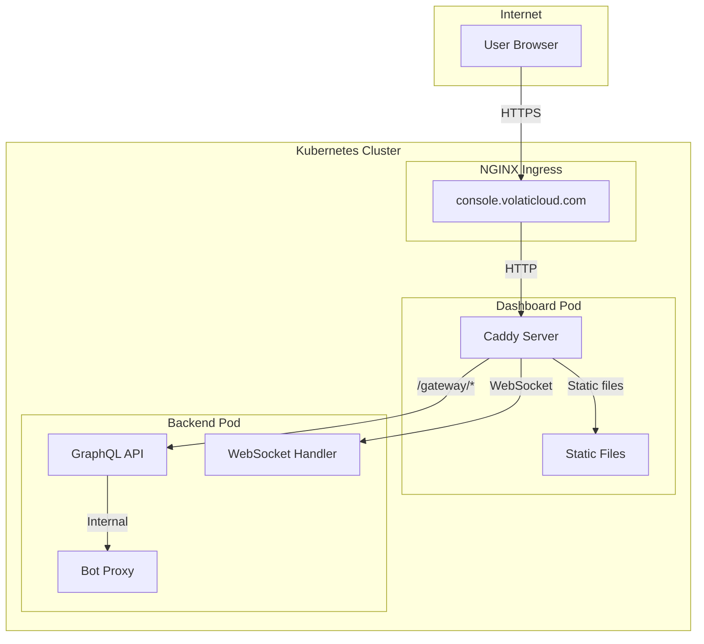

# ADR-0019: Internal Backend Architecture

## Status

Accepted

## Context

VolatiCloud's production deployment needs to expose API endpoints to users while maintaining security best practices. The backend service handles:

1. **GraphQL API**: Queries, mutations, and subscriptions
2. **Bot Proxy**: Authenticated proxying to FreqTrade instances
3. **Health Endpoints**: Kubernetes liveness/readiness probes
4. **Metrics**: Prometheus scraping (internal)

Initially, both the dashboard and backend had separate external ingresses:
- `console.volaticloud.com` - Dashboard (Caddy serving static files)
- `api.volaticloud.com` - Backend (direct external access)

This dual-ingress approach introduced several concerns:

1. **CORS complexity**: Cross-origin requests require CORS headers and preflight handling
2. **Security surface**: Backend directly exposed to internet increases attack surface
3. **Token exposure**: JWTs visible in cross-origin request headers
4. **WebSocket handling**: Separate WebSocket endpoint management needed for subscriptions

## Decision

**The backend is internal-only.** All external traffic flows through the dashboard's Caddy reverse proxy.

### Architecture



### Traffic Flow

| Path | Handler | Description |
|------|---------|-------------|
| `/` | Caddy file_server | Dashboard SPA |
| `/frequi/*` | Caddy file_server | FreqUI embedded app |
| `/gateway/v1/graphql` | Backend | GraphQL queries/mutations |
| `/gateway/v1/graphql` (WS) | Backend | GraphQL subscriptions |
| `/gateway/v1/bot/:id/*` | Backend | Bot proxy (FreqTrade API) |
| `/gateway/v1/health` | Backend | Health check endpoint |

### Caddy Configuration

The dashboard's Caddyfile handles reverse proxying:

```caddy
handle /gateway/* {
    reverse_proxy http://volaticloud-backend-volaticloud-backend:8080 {
        # Flush immediately for WebSocket/streaming responses
        flush_interval -1

        # Extended timeouts for WebSocket connections
        transport http {
            read_timeout 0
            write_timeout 0
        }
    }
}
```

Key configurations:
- **`flush_interval -1`**: Disables response buffering for WebSocket/SSE
- **`read_timeout 0`**: No timeout for long-lived WebSocket connections
- **`write_timeout 0`**: No timeout for streaming responses

### NGINX Ingress Configuration

The ingress supports WebSocket upgrade:

```yaml
annotations:
  nginx.ingress.kubernetes.io/proxy-read-timeout: "3600"
  nginx.ingress.kubernetes.io/proxy-send-timeout: "3600"
```

These 1-hour timeouts accommodate GraphQL subscriptions.

### Service Configuration

Backend service is ClusterIP (internal only):

```yaml
services:
  volaticloud-backend:
    type: ClusterIP  # Not exposed externally
    ports:
      - name: http
        port: 8080
        targetPort: http
```

**No ingress is defined for the backend service.**

## Consequences

### Positive

- **Same-origin API calls**: No CORS needed, browser treats API as same-origin
- **Simplified authentication**: Cookies work seamlessly, no cross-origin token handling
- **Reduced attack surface**: Backend not directly exposed to internet
- **Single entry point**: All traffic through one ingress simplifies monitoring/security
- **WebSocket simplicity**: WS connections use same origin, no special handling needed
- **Certificate management**: Single TLS certificate for all services

### Negative

- **Caddy dependency**: Dashboard container must handle reverse proxying
- **Single point of failure**: Dashboard unavailability blocks API access
- **Latency**: Extra hop through Caddy (minimal, ~1ms)

### Mitigations

- Dashboard has HPA with 2-10 replicas for high availability
- PodDisruptionBudget ensures minimum 1 pod during deployments
- Caddy is lightweight and handles thousands of concurrent connections
- Health checks detect and restart unhealthy pods quickly

## Alternatives Considered

### 1. Dual External Ingress (Rejected)

**Original approach:**
- `api.volaticloud.com` - Backend direct access
- `console.volaticloud.com` - Dashboard

**Rejected because:**
- CORS complexity for cross-origin API calls
- Separate WebSocket origin handling
- Increased attack surface
- Token visibility in cross-origin headers

### 2. API Gateway (Kong, Ambassador)

**Considered:**
- Dedicated API gateway between ingress and backend

**Rejected because:**
- Additional infrastructure complexity
- Caddy handles reverse proxy needs adequately
- Cost of additional service in cluster
- Unnecessary for current scale

### 3. Service Mesh (Istio, Linkerd)

**Considered:**
- mTLS between services
- Advanced traffic management

**Rejected because:**
- Significant operational overhead
- Not justified for current service count
- Caddy + K8s native features sufficient

## Implementation Notes

### Local Development

For local development, the dashboard runs `vite dev` with proxy configuration:

```typescript
// vite.config.ts
server: {
    proxy: {
        '/gateway': {
            target: 'http://localhost:8080',
            ws: true,  // WebSocket support
        }
    }
}
```

### Health Checks

Backend health is checked internally by Kubernetes:

```yaml
livenessProbe:
    httpGet:
        path: /gateway/v1/health
        port: http
```

External health monitoring should use the dashboard endpoint, which implicitly validates backend connectivity.

### Metrics

Prometheus scrapes metrics directly from backend pods using internal service discovery:

```yaml
podAnnotations:
    prometheus.io/scrape: "true"
    prometheus.io/port: "8080"
    prometheus.io/path: /metrics
```

This does not require external ingress.

## References

- [ADR-0007: Kubernetes Deployment Strategy](./0007-kubernetes-deployment-strategy.md)
- [ADR-0018: GraphQL WebSocket Subscriptions](./0018-graphql-websocket-subscriptions.md)
- [Caddy Reverse Proxy Documentation](https://caddyserver.com/docs/caddyfile/directives/reverse_proxy)
- [NGINX Ingress WebSocket Support](https://kubernetes.github.io/ingress-nginx/user-guide/miscellaneous/#websockets)
