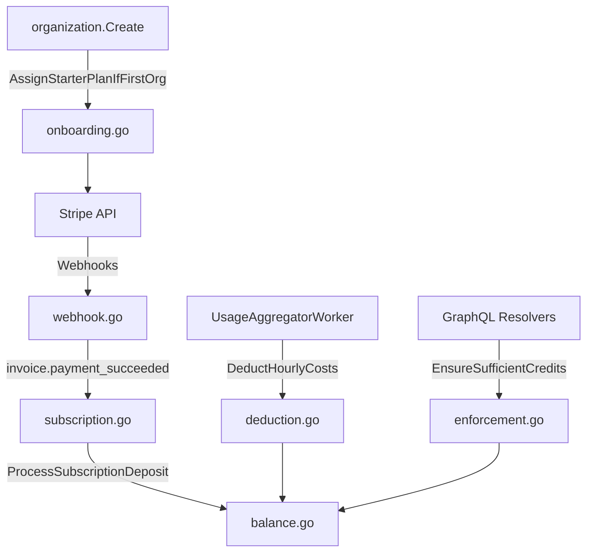

# ADR-0022: Credit-Based Billing System

## Status

Accepted

## Context

VolatiCloud needs a billing system to monetize compute resources consumed by bots and backtests. The system must support multiple subscription tiers, handle prepaid credits, enforce usage limits, and gate features by plan.

## Decision

Implement a prepaid credit/deposit system where:

- **1 credit = $1** — simple, transparent pricing
- **Stripe Billing** manages subscriptions and payments (source of truth)
- **Credits are deducted hourly** using the existing usage aggregation infrastructure
- **Organizations are suspended** when balance reaches zero (bots stopped, new resource creation blocked)

### Subscription Plans

| Plan | Price | Monthly Deposit |
|------|-------|-----------------|
| Starter | Free | $5 |
| Pro | $29/mo | $60 |
| Enterprise | $79/mo | $200 |

**Renewal rule:** The full monthly deposit is always added to the balance on each renewal. Manual deposits are independent and do not reduce the subscription deposit.

**Auto-assign:** Each new organization gets auto-assigned the Starter plan if it doesn't already have a subscription. Multi-org abuse (users creating many orgs for free credits) should be addressed at the resolver layer via Keycloak group membership checks — see `onboarding.go` for details.

### Architecture

### New ENT Schemas

- **CreditBalance** — one row per org, tracks balance and suspension state
- **CreditTransaction** — append-only ledger with idempotency via `reference_id`
- **StripeSubscription** — links org to Stripe subscription, includes `features` JSON field

### Feature Gating

New `@requiresFeature` GraphQL directive checks subscription features before resolver execution. Feature flags are stored in Stripe product metadata and synced to `StripeSubscription.features`.

### Integration Points

1. **Hourly deduction** — `UsageAggregatorWorker.runAggregation()` calls `BillingService.DeductHourlyCosts()`
2. **Org creation** — `CreateOrganization` resolver creates balance record and assigns Starter plan
3. **Resource enforcement** — `CreateBot`, `StartBot`, `RestartBot`, `RunBacktest` check `EnsureSufficientCredits`
4. **Webhook endpoint** — `/gateway/v1/webhooks/stripe` handles Stripe events

## Consequences

### Positive

- Simple credit model (1:1 with dollars) is easy to understand
- Stripe handles payment processing, subscription management, and invoice generation
- Hourly billing cadence reuses existing usage aggregation infrastructure
- Feature gating via directive is declarative and easy to add to new resolvers
- Idempotent transactions prevent double-charging on webhook retries

### Negative

- Requires Stripe API key for full billing functionality (graceful degradation when not configured)
- Feature flags cached in DB — changes require Stripe webhook or manual sync
- Admin mutations for credit adjustment lack fine-grained RBAC (only `@isAuthenticated`)

### Risks

- Stripe API availability affects subscription creation (not existing operations)
- Need monitoring for webhook delivery failures
- **Multi-org starter plan abuse**: Users can create multiple organizations to receive a starter plan deposit per org. Bounded by Keycloak rate limits on org creation and the small deposit amount ($5). Cross-org checks would require Keycloak lookups at the resolver layer; accepted risk for now
- **Credit enforcement race window**: `EnsureSufficientCredits` is a best-effort guard, not a transactional lock. Between the check and the actual operation, credits could be depleted by hourly deduction. Worst case: one extra resource starts and runs for up to 1 hour before the next deduction cycle stops it. ENT does not support `SELECT FOR UPDATE`, and distributed locks would add significant complexity for minimal benefit
