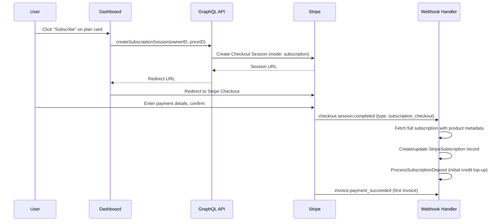
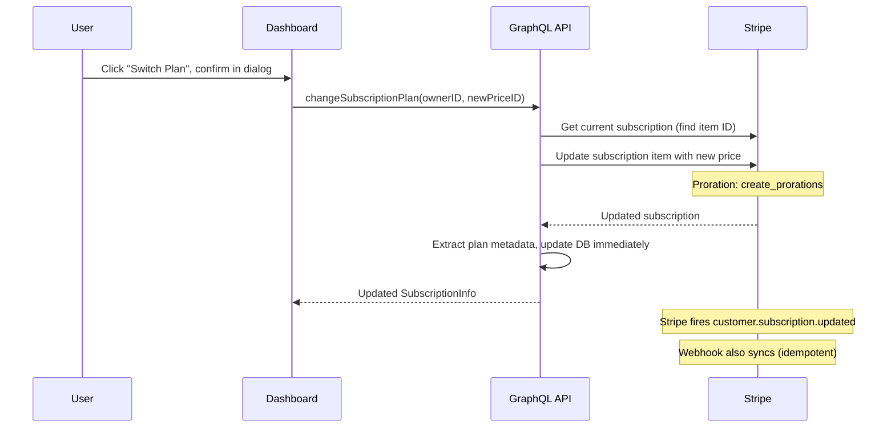
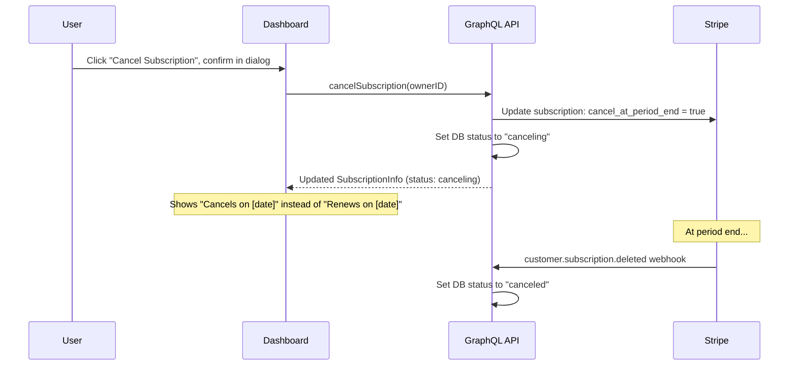
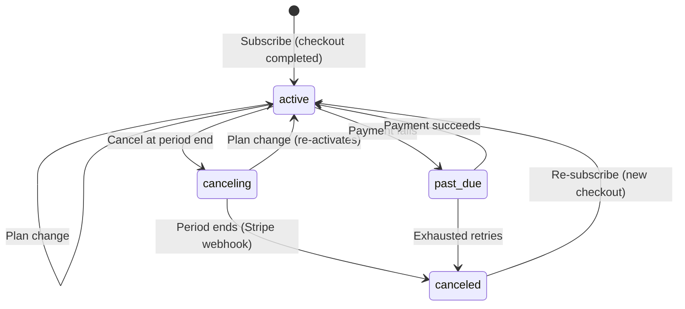

# ADR-0023: Self-Service Subscription Management

Date: 2026-01-31

## Status

Accepted

## Context and Problem Statement

ADR-0022 established the credit-based billing system with Stripe integration, but subscription management (subscribe, change plan, cancel) required admin intervention. Users need self-service flows to manage their own subscriptions from the billing page.

Key questions this ADR addresses:

- How does subscribing work?
- What happens when a user cancels?
- What happens to credits and money when switching plans?
- What happens to credits when canceling?

## Decision Drivers

- Users must be able to subscribe without admin help
- Plan changes must be fair (prorated)
- Cancellation must not immediately disrupt service
- Credits are prepaid and non-refundable (simpler accounting)
- Stripe should remain the source of truth for subscription state

## Decision Outcome

### Subscribe Flow

Users subscribe via Stripe Checkout (hosted payment page). The flow is:



**Guard rails:**

- If org already has an active or canceling subscription, the mutation returns an error
- If org previously had a canceled subscription, the existing Stripe customer ID is reused
- If no prior subscription exists, a new Stripe customer is created

### Change Plan Flow

Plan changes use Stripe's subscription update API with prorations:



**Proration behavior (`create_prorations`):**

- **Upgrading** (e.g., Starter -> Pro): User is charged the prorated difference for the remaining days on the next invoice. The new higher monthly deposit takes effect at the next renewal.
- **Downgrading** (e.g., Pro -> Starter): User receives a prorated credit on the next invoice. The new lower monthly deposit takes effect at the next renewal.
- **Credits are NOT adjusted** during plan change. Existing credit balance is untouched. Only the `monthlyDeposit` amount changes for future renewals.

**If the subscription was in `canceling` state**, switching plans also clears the `cancel_at_period_end` flag, re-activating the subscription.

### Cancel Flow

Cancellation uses Stripe's "cancel at period end" — the subscription stays active until the billing period expires:



**What happens on cancel:**

| Aspect | Behavior | Rationale |
|--------|----------|-----------|
| **Service access** | Continues until period end | User paid for the full period |
| **Credits** | Remain in balance, continue to be usable | Credits are prepaid, non-refundable |
| **Monthly deposit** | No more deposits after cancellation | No renewal = no deposit |
| **Money refund** | No refund for current period | Stripe handles this — `cancel_at_period_end` means no prorated refund |
| **Feature gating** | Features remain until period end | Status is `canceling` (not `canceled`) |
| **Re-subscribe** | User can subscribe to any plan after cancellation | Reuses existing Stripe customer ID |

### Subscription Status Lifecycle



### Credit Deposit Rules on Renewal

The `ProcessSubscriptionDeposit` function (from ADR-0022) has specific rules:

1. **Only deposits if status is `active`** — `canceling` subscriptions skip deposits
2. **Full deposit**: The full `monthlyDeposit` amount is always added. Manual deposits are independent and do not reduce the subscription deposit
3. **Idempotent**: Uses `reference_id` to prevent duplicate deposits on webhook retries

## Implementation

### Key Files

- `internal/enum/billing.go` — Added `StripeSubCanceling` status
- `internal/billing/stripe.go` — `CreateSubscriptionCheckoutSession`, `UpdateSubscriptionPrice`, `CancelSubscriptionAtPeriodEnd`
- `internal/billing/webhook.go` — `handleSubscriptionCheckout`, updated `mapStripeStatusWithCancel`
- `internal/graph/schema.graphqls` — 3 new mutations with `@hasScope` ORGANIZATION edit
- `internal/graph/schema.resolvers.go` — Resolver implementations
- `dashboard/src/components/Billing/billing.graphql` — Frontend GraphQL operations
- `dashboard/src/pages/Organization/OrganizationBillingPage.tsx` — Subscribe/Switch/Cancel UI

### GraphQL Mutations

```graphql
# Start a new subscription via Stripe Checkout
createSubscriptionSession(ownerID: String!, priceID: String!): String!
  @hasScope(resource: "ownerID", scope: "edit", resourceType: ORGANIZATION)

# Change plan on existing subscription (with proration)
changeSubscriptionPlan(ownerID: String!, newPriceID: String!): SubscriptionInfo!
  @hasScope(resource: "ownerID", scope: "edit", resourceType: ORGANIZATION)

# Cancel at end of current billing period
cancelSubscription(ownerID: String!): SubscriptionInfo!
  @hasScope(resource: "ownerID", scope: "edit", resourceType: ORGANIZATION)
```

## Consequences

### Positive

- Users can fully manage subscriptions without admin intervention
- Stripe Checkout handles PCI compliance for payment collection
- Prorations are fair and automatic via Stripe
- Cancellation is non-disruptive (service continues until period end)
- Credits persist through cancellation (no clawback complexity)

### Negative

- No immediate refunds on cancellation (by design — credits model is prepaid)
- Plan change requires confirmation dialog (extra click) to prevent accidental changes
- Webhook dependency: subscription record creation happens asynchronously after checkout

### Risks

- If Stripe webhook is delayed after checkout, user returns to billing page before subscription appears. Mitigated by 3-second delayed refetch on `?subscription=success` return.
- Plan change updates DB immediately AND via webhook — must be idempotent. Current implementation is safe because webhook uses same extraction logic.

## References

- [ADR-0022](0022-credit-based-billing.md) — Credit-Based Billing System (foundation)
- [ADR-0008](0008-multi-tenant-authorization.md) — Multi-Tenant Authorization (scope enforcement)
- [Stripe Checkout Subscriptions](https://docs.stripe.com/billing/subscriptions/build-subscriptions?ui=checkout)
- [Stripe Subscription Prorations](https://docs.stripe.com/billing/subscriptions/prorations)
- [Stripe Cancel at Period End](https://docs.stripe.com/billing/subscriptions/cancel)
