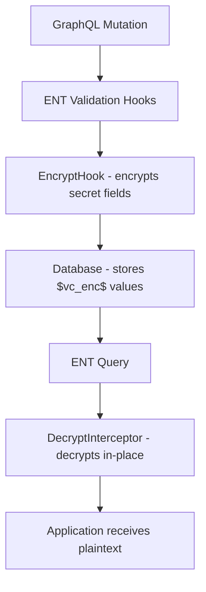

# 0026. Field-Level Encryption for Config Secrets

Date: 2026-02-02

## Status

Accepted

## Context and Problem Statement

VolatiCloud stores sensitive credentials (exchange API keys, Docker TLS certificates, Kubernetes kubeconfigs, S3 access keys) inside JSON config blobs in the database. These values are stored as plaintext, meaning a database compromise exposes all credentials. We need encryption at rest for these specific fields while keeping non-secret fields (exchange name, pair whitelist, timeframe) queryable and inspectable.

## Decision Drivers

- Database compromise must not expose user credentials
- Non-secret config fields must remain plaintext for debugging and querying
- Encryption must be transparent to application code reading configs
- Rollout must be safe — existing plaintext data must remain readable
- Implementation must follow DDD principles (domain packages own their secret definitions)

## Considered Options

### Option 1: Full-Column Encryption

Encrypt the entire JSON config column.

**Pros:**

- Simple implementation — encrypt/decrypt the whole blob
- No need to track which fields are secret

**Cons:**

- Loses ability to query or inspect non-secret fields
- All-or-nothing — can't partially decrypt for debugging
- Larger encrypted payloads

### Option 2: Field-Level AES-256-GCM Encryption

Encrypt only sensitive fields within the JSON config, identified by dot-separated paths.

**Pros:**

- Non-secret fields remain plaintext and queryable
- Granular control over what gets encrypted
- Smaller encrypted payloads
- Easy to add new secret paths per domain

**Cons:**

- More complex traversal logic
- Must maintain list of secret field paths per entity

### Option 3: External Secrets Manager (Vault/KMS)

Store secrets in an external secrets manager, reference by ID in config.

**Pros:**

- Industry-standard key management
- Built-in audit logging and rotation

**Cons:**

- Adds infrastructure dependency
- Significant refactoring of config read/write paths
- Higher operational complexity for self-hosted deployments

## Decision Outcome

Chosen option: **Field-Level AES-256-GCM Encryption**, because it provides targeted protection for sensitive fields while keeping non-secret data accessible, requires no infrastructure changes, and integrates cleanly with ENT hooks.

### Consequences

**Positive:**

- Sensitive credentials encrypted at rest with authenticated encryption
- Transparent to application code via ENT hooks/interceptors
- Graceful migration — plaintext passes through unchanged, encrypted on next write
- Each domain package owns its secret field definitions

**Negative:**

- Encryption key must be managed securely (env var for now)
- Key rotation supported via versioned format and old key fallback
- If encryption key is lost, encrypted data is unrecoverable

**Neutral:**

- Small performance overhead for encrypt/decrypt on config read/write
- Database backups contain encrypted values (good for security, requires key for restore)

## Implementation

### Key Files

- `internal/secrets/encrypt.go` — AES-256-GCM singleton encryptor, versioned `$vc_enc$v1$` prefix, multi-key support
- `internal/secrets/transform.go` — Dot-path traversal for nested JSON maps
- `internal/secrets/hooks.go` — ENT mutation hook (encrypt on write) and interceptors (decrypt on read)
- `internal/exchange/secrets.go` — Exchange secret field paths
- `internal/runner/secrets.go` — Runner and S3 secret field paths
- `internal/bot/secrets.go` — Bot secure_config secret field paths
- `cmd/server/main.go` — `VOLATICLOUD_ENCRYPTION_KEY` and `VOLATICLOUD_OLD_ENCRYPTION_KEYS` initialization

### Architecture



### Secret Field Paths

| Entity | Config Field | Secret Paths |
|--------|-------------|-------------|
| Exchange | `config` | `exchange.key`, `exchange.secret`, `exchange.password`, `exchange.private_key` |
| BotRunner | `config` | `docker.certPEM`, `docker.keyPEM`, `docker.caPEM`, `docker.registryAuth.username`, `docker.registryAuth.password`, `kubernetes.kubeconfig` |
| BotRunner | `s3_config` | `accessKeyId`, `secretAccessKey` |
| Bot | `secure_config` | `api_server.username`, `api_server.password`, `api_server.jwt_secret_key` |

### Encryption Format

New encryptions use the versioned format:

```
$vc_enc$v1$<base64(nonce || ciphertext || tag)>
```

Legacy format (`$vc_enc$<base64>`) is still supported for decryption (backward compatible).

- AES-256-GCM with 12-byte random nonce
- Same plaintext produces different ciphertext each time (random nonce)
- `$vc_enc$` prefix enables idempotent encryption and plaintext detection
- Version tag (`v1$`) enables future format evolution

### Migration Strategy

1. **No forced migration** — deploy with encryption key, existing plaintext works
2. **Lazy migration** — on next update, plaintext is encrypted automatically
3. **Bulk migration** — optional admin command can encrypt all existing data

### Key Rotation

Key rotation is supported via `VOLATICLOUD_OLD_ENCRYPTION_KEYS` (comma-separated base64 keys).

**Rotation procedure:**

1. Generate a new 32-byte AES key: `openssl rand -base64 32`
2. Move the current `VOLATICLOUD_ENCRYPTION_KEY` value to `VOLATICLOUD_OLD_ENCRYPTION_KEYS`
3. Set the new key as `VOLATICLOUD_ENCRYPTION_KEY`
4. Deploy — decryption tries the primary key first, then falls back to old keys
5. Data is re-encrypted with the new key on next write (lazy migration)
6. After all data has been re-encrypted, remove old keys from `VOLATICLOUD_OLD_ENCRYPTION_KEYS`

**Future improvements:**

- Bulk re-encryption command for immediate rotation
- Consider KMS integration for production key management

## Validation

- `go test ./internal/secrets/...` — 78.5% coverage
- Verify encrypted values in DB start with `$vc_enc$`
- Verify plaintext passthrough when encryption disabled
- Verify round-trip: write encrypted → read decrypted

## References

- [AES-GCM (NIST SP 800-38D)](https://csrc.nist.gov/publications/detail/sp/800-38d/final)
- [ADR-0002](0002-ent-orm-with-graphql.md) — ENT ORM integration
- [ADR-0008](0008-multi-tenant-authorization.md) — Multi-tenant authorization (view-secrets scope)
