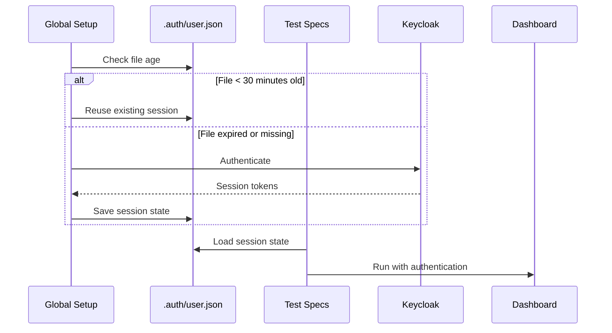

# 0027. E2E Testing Framework with Playwright

Date: 2026-02-07

## Status

Accepted

## Context and Problem Statement

VolatiCloud is a complex full-stack application with:

- React dashboard with real-time WebSocket updates
- Go backend with GraphQL API
- Keycloak authentication with SSO
- Multiple infrastructure services (PostgreSQL, etcd, MinIO)

**The Problem:** How do we achieve high confidence that the entire system works correctly from a user's perspective, catching issues that unit and integration tests miss?

## Decision Drivers

- **Production fidelity**: Tests must run against a production-like environment
- **Reliability**: Tests must be deterministic and not flaky
- **Speed**: Tests should run efficiently in CI without excessive timeouts
- **Maintainability**: Test code must be easy to understand and extend
- **Developer experience**: Running tests locally should be straightforward

## Considered Options

### Option 1: Cypress

**Pros:**

- Excellent debugging experience with time-travel
- Large community and ecosystem
- Built-in retry mechanisms

**Cons:**

- Limited to Chromium-based browsers
- Slower execution for large test suites
- Component testing approach differs from E2E

### Option 2: Selenium/WebDriver

**Pros:**

- Industry standard, well-documented
- Multi-browser support

**Cons:**

- Complex setup with drivers
- Slower execution
- Verbose API

### Option 3: Playwright (Chosen)

**Pros:**

- **Fast execution** with parallel test support
- **Multi-browser** support (Chromium, Firefox, WebKit)
- **Auto-waiting** for elements reduces flakiness
- **First-class TypeScript** support
- **Built-in test runner** with fixtures and hooks
- **Network interception** for testing edge cases
- **Trace viewer** for debugging failures

**Cons:**

- Smaller community than Cypress
- Steeper learning curve

## Decision

Use **Playwright** as the E2E testing framework with:

1. **Production-replica environment** via Docker Compose
2. **Session reuse** for faster test execution
3. **Flow-based architecture** for reusable test helpers
4. **Console error tracking** for catching client-side issues

## Architecture

### Test Organization

```
dashboard/e2e/
├── .auth/                    # Persisted authentication state
│   └── user.json            # Session storage for reuse
├── flows/                    # Reusable interaction helpers
│   ├── auth.flow.ts         # Authentication and navigation
│   ├── bot.flow.ts          # Bot management operations
│   ├── exchange.flow.ts     # Exchange configuration
│   ├── organization.flow.ts # Organization setup
│   ├── runner.flow.ts       # Runner and data download
│   └── strategy.flow.ts     # Strategy builder operations
├── specs/                    # Test specifications
│   ├── 00-setup.spec.ts     # Environment setup (runs first)
│   ├── 01-smoke.spec.ts     # Basic connectivity tests
│   ├── 02-billing.spec.ts   # Stripe integration
│   ├── 03-runner-data.spec.ts
│   └── ...                  # Additional test suites
├── fixtures.ts              # Custom Playwright fixtures
├── global-setup.ts          # One-time authentication
├── state.ts                 # Cross-test state management
└── console-tracker.ts       # JavaScript error detection
```

### Session Reuse Strategy



**Rationale:** Re-authenticating for every test wastes ~10 seconds per test. With 50+ tests, this adds 8+ minutes to CI. Session reuse reduces total auth time to ~10 seconds.

### State Management

Tests share context via JSON file (`e2e-state.json`):

```typescript
interface E2EState {
  orgId: string;
  orgAlias: string;
  runnerId: string;
  runnerName: string;
  runnerDataReady: boolean;
}
```

**Why JSON files?**

- Survives process boundaries (parallel workers)
- Easy to debug (human-readable)
- No database dependency
- Simple to reset between runs

### Flow Helpers

Flow helpers encapsulate complex interactions:

```typescript
// flows/runner.flow.ts
export async function createRunnerWithDataDownload(
  page: Page,
  name: string
): Promise<string> {
  // Open drawer, fill form, submit
  // Wait for WebSocket progress updates
  // Return runner ID
}
```

**Benefits:**

- DRY principle - interactions defined once
- Consistent error handling
- Easy to update when UI changes
- Self-documenting test code

### Console Error Tracking

Custom fixture automatically monitors browser console:

```typescript
test.extend({
  consoleTracker: async ({ page }, use) => {
    const tracker = trackConsole(page);
    await use(tracker);
    if (tracker.hasCriticalErrors()) {
      throw new Error(tracker.getSummary());
    }
  }
});
```

**Catches:**

- Unhandled promise rejections
- React rendering errors
- Network failures
- JavaScript exceptions

### Docker Compose Environment

```yaml
# docker-compose.e2e.yml
services:
  postgres:     # Keycloak database
  keycloak:     # Authentication (with test realm)
  etcd:         # Pub/sub backend
  minio:        # S3-compatible storage
  backend:      # Go GraphQL server
  dashboard:    # React app via Caddy
  playwright:   # Test runner
```

**Network isolation:** All services on `volaticloud-e2e` network with proper DNS resolution.

## Consequences

### Positive

- **High confidence** in full user workflows
- **Catches integration issues** that unit tests miss
- **Production-like environment** reduces "works on my machine" issues
- **Parallel execution** keeps CI times reasonable
- **Reusable flows** speed up new test development

### Negative

- **Slower than unit tests** (~5-10 minutes for full suite)
- **Docker dependency** for local development
- **Maintenance overhead** for Docker Compose environment
- **Flakiness risk** with network-dependent tests

### Mitigations

- **Parallel workers** (`E2E_WORKERS=3`) reduce wall-clock time
- **Retry mechanisms** for transient failures
- **Console tracking** catches client errors early
- **Health checks** ensure services are ready before tests

## Test Categories

| Category | Purpose | Example |
|----------|---------|---------|
| Setup | Environment initialization | Create org, runner |
| Smoke | Basic connectivity | Page loads, auth works |
| Billing | Stripe integration | Subscription flow |
| CRUD | Resource management | Create/edit/delete |
| Error | Error handling | Invalid inputs, network failures |
| Permission | Authorization | Access control |
| WebSocket | Real-time updates | Progress notifications |
| Concurrent | Parallel operations | Multiple tabs |

## Running Tests

```bash
# Local development
make e2e-setup     # One-time: install CA cert, hosts entries
make e2e           # Run full E2E suite

# CI (GitHub Actions)
# Automatically runs on PR to main
# Uses Docker layer caching for faster builds
```

## References

- [ADR-0017: Hybrid Testing Strategy](0017-hybrid-testing-strategy.md) - Backend testing approach
- [ADR-0018: GraphQL WebSocket Subscriptions](0018-graphql-websocket-subscriptions.md) - Real-time updates
- [Playwright Documentation](https://playwright.dev/docs/intro)
