# Go Module Dependencies

> Auto-generated dependency graph
> Generated: Wed Nov 26 14:24:04 CET 2025
> Module: volaticloud

## Dependency Overview

```mermaid
graph TD
    %% Direct Dependencies
    volaticloud["volaticloud"] --> entgo_io_contrib_at_v0_7_0["contrib"]
    volaticloud["volaticloud"] --> entgo_io_ent_at_v0_14_5["ent"]
    volaticloud["volaticloud"] --> github_com_99designs_gqlgen_at_v0_17_81["gqlgen"]
    volaticloud["volaticloud"] --> github_com_Nerzal_gocloak_v13_at_v13_9_0["v13"]
    volaticloud["volaticloud"] --> github_com_coreos_go_oidc_v3_at_v3_16_0["v3"]
    volaticloud["volaticloud"] --> github_com_docker_docker_at_v28_5_1+incompatible["docker"]
    volaticloud["volaticloud"] --> github_com_docker_go_connections_at_v0_6_0["go-connections"]
    volaticloud["volaticloud"] --> github_com_go_chi_chi_v5_at_v5_2_3["v5"]
    volaticloud["volaticloud"] --> github_com_go_chi_cors_at_v1_2_2["cors"]
    volaticloud["volaticloud"] --> github_com_golang_jwt_jwt_v5_at_v5_3_0["v5"]
    volaticloud["volaticloud"] --> github_com_google_uuid_at_v1_6_0["uuid"]
    volaticloud["volaticloud"] --> github_com_hashicorp_go_multierror_at_v1_1_1["go-multierror"]
    volaticloud["volaticloud"] --> github_com_joho_godotenv_at_v1_5_1["godotenv"]
    volaticloud["volaticloud"] --> github_com_lib_pq_at_v1_10_9["pq"]
    volaticloud["volaticloud"] --> github_com_mattn_go_sqlite3_at_v1_14_32["go-sqlite3"]
    volaticloud["volaticloud"] --> github_com_stretchr_testify_at_v1_11_1["testify"]
    volaticloud["volaticloud"] --> github_com_urfave_cli_v2_at_v2_27_7["v2"]
    volaticloud["volaticloud"] --> github_com_vektah_gqlparser_v2_at_v2_5_31["v2"]
    volaticloud["volaticloud"] --> github_com_xeipuuv_gojsonschema_at_v1_2_0["gojsonschema"]
    volaticloud["volaticloud"] --> go_etcd_io_etcd_client_v3_at_v3_6_5["v3"]
    volaticloud["volaticloud"] --> golang_org_x_oauth2_at_v0_33_0["oauth2"]
```



## Direct Dependencies

The following packages are direct dependencies of this project:

- **entgo.io/contrib** - `v0.7.0`
- **entgo.io/ent** - `v0.14.5`
- **github.com/99designs/gqlgen** - `v0.17.81`
- **github.com/Nerzal/gocloak/v13** - `v13.9.0`
- **github.com/coreos/go-oidc/v3** - `v3.16.0`
- **github.com/docker/docker** - `v28.5.1+incompatible`
- **github.com/docker/go-connections** - `v0.6.0`
- **github.com/go-chi/chi/v5** - `v5.2.3`
- **github.com/go-chi/cors** - `v1.2.2`
- **github.com/golang-jwt/jwt/v5** - `v5.3.0`
- **github.com/google/uuid** - `v1.6.0`
- **github.com/hashicorp/go-multierror** - `v1.1.1`
- **github.com/joho/godotenv** - `v1.5.1`
- **github.com/lib/pq** - `v1.10.9`
- **github.com/mattn/go-sqlite3** - `v1.14.32`
- **github.com/stretchr/testify** - `v1.11.1`
- **github.com/urfave/cli/v2** - `v2.27.7`
- **github.com/vektah/gqlparser/v2** - `v2.5.31`
- **github.com/xeipuuv/gojsonschema** - `v1.2.0`
- **go.etcd.io/etcd/client/v3** - `v3.6.5`
- **golang.org/x/oauth2** - `v0.33.0`

## Statistics

```
Total Dependencies: 200
Direct Dependencies: 21
Indirect Dependencies: 179
```

## Indirect Dependencies

<details>
<summary>View all indirect dependencies (transitive)</summary>

- **ariga.io/atlas** - `v0.37.0`
- **cel.dev/expr** - `v0.24.0`
- **cloud.google.com/go/compute/metadata** - `v0.7.0`
- **github.com/AlekSi/pointer** - `v1.1.0`
- **github.com/Azure/go-ansiterm** - `v0.0.0-20250102033503-faa5f7b0171c`
- **github.com/BurntSushi/toml** - `v1.5.0`
- **github.com/DATA-DOG/go-sqlmock** - `v1.5.0`
- **github.com/GoogleCloudPlatform/opentelemetry-operations-go/detectors/gcp** - `v1.29.0`
- **github.com/Microsoft/go-winio** - `v0.4.21`
- **github.com/PuerkitoBio/goquery** - `v1.10.3`
- **github.com/agext/levenshtein** - `v1.2.3`
- **github.com/agnivade/levenshtein** - `v1.2.1`
- **github.com/alecthomas/kong** - `v0.7.0`
- **github.com/andreyvit/diff** - `v0.0.0-20170406064948-c7f18ee00883`
- **github.com/andybalholm/cascadia** - `v1.3.3`
- **github.com/antihax/optional** - `v1.0.0`
- **github.com/apparentlymart/go-textseg/v13** - `v13.0.0`
- **github.com/apparentlymart/go-textseg/v15** - `v15.0.0`
- **github.com/arbovm/levenshtein** - `v0.0.0-20160628152529-48b4e1c0c4d0`
- **github.com/beorn7/perks** - `v1.0.1`
- **github.com/bmatcuk/doublestar** - `v1.3.4`
- **github.com/bmatcuk/doublestar/v4** - `v4.0.2`
- **github.com/cenkalti/backoff/v5** - `v5.0.3`
- **github.com/cespare/xxhash/v2** - `v2.3.0`
- **github.com/cncf/xds/go** - `v0.0.0-20250501225837-2ac532fd4443`
- **github.com/containerd/errdefs** - `v1.0.0`
- **github.com/containerd/errdefs/pkg** - `v0.3.0`
- **github.com/containerd/log** - `v0.1.0`
- **github.com/containerd/typeurl/v2** - `v2.2.0`
- **github.com/coreos/go-semver** - `v0.3.1`
- **github.com/coreos/go-systemd/v22** - `v22.5.0`
- **github.com/cpuguy83/go-md2man/v2** - `v2.0.7`
- **github.com/creack/pty** - `v1.1.18`
- **github.com/davecgh/go-spew** - `v1.1.1`
- **github.com/dgryski/trifles** - `v0.0.0-20230903005119-f50d829f2e54`
- **github.com/distribution/reference** - `v0.6.0`
- **github.com/dlclark/regexp2** - `v1.7.0`
- **github.com/docker/go-units** - `v0.5.0`
- **github.com/dustin/go-humanize** - `v1.0.1`
- **github.com/envoyproxy/go-control-plane** - `v0.13.4`
- **github.com/envoyproxy/go-control-plane/envoy** - `v1.32.4`
- **github.com/envoyproxy/go-control-plane/ratelimit** - `v0.1.0`
- **github.com/envoyproxy/protoc-gen-validate** - `v1.2.1`
- **github.com/fatih/color** - `v1.13.0`
- **github.com/felixge/httpsnoop** - `v1.0.4`
- **github.com/ghodss/yaml** - `v1.0.0`
- **github.com/go-faster/errors** - `v0.6.1`
- **github.com/go-faster/jx** - `v0.40.0`
- **github.com/go-faster/yamlx** - `v0.4.1`
- **github.com/go-jose/go-jose/v4** - `v4.1.3`
- **github.com/go-logr/logr** - `v1.4.3`
- **github.com/go-logr/stdr** - `v1.2.2`
- **github.com/go-openapi/inflect** - `v0.21.3`
- **github.com/go-resty/resty/v2** - `v2.7.0`
- **github.com/go-test/deep** - `v1.0.3`
- **github.com/go-viper/mapstructure/v2** - `v2.4.0`
- **github.com/godbus/dbus/v5** - `v5.0.4`
- **github.com/gogo/protobuf** - `v1.3.2`
- **github.com/golang/glog** - `v1.2.5`
- **github.com/golang/groupcache** - `v0.0.0-20210331224755-41bb18bfe9da`
- **github.com/golang/protobuf** - `v1.5.4`
- **github.com/google/addlicense** - `v1.1.1`
- **github.com/google/go-cmp** - `v0.7.0`
- **github.com/gorilla/websocket** - `v1.5.3`
- **github.com/grpc-ecosystem/go-grpc-middleware/providers/prometheus** - `v1.0.1`
- **github.com/grpc-ecosystem/go-grpc-middleware/v2** - `v2.1.0`
- **github.com/grpc-ecosystem/grpc-gateway/v2** - `v2.27.2`
- **github.com/hashicorp/errwrap** - `v1.1.0`
- **github.com/hashicorp/golang-lru/v2** - `v2.0.7`
- **github.com/hashicorp/hcl/v2** - `v2.24.0`
- **github.com/inconshreveable/mousetrap** - `v1.1.0`
- **github.com/jessevdk/go-flags** - `v1.5.0`
- **github.com/jhump/protoreflect** - `v1.10.1`
- **github.com/json-iterator/go** - `v1.1.12`
- **github.com/kevinmbeaulieu/eq-go** - `v1.0.0`
- **github.com/kisielk/errcheck** - `v1.5.0`
- **github.com/kisielk/gotool** - `v1.0.0`
- **github.com/klauspost/compress** - `v1.17.9`
- **github.com/kr/pretty** - `v0.3.1`
- **github.com/kr/text** - `v0.2.0`
- **github.com/kylelemons/godebug** - `v1.1.0`
- **github.com/logrusorgru/aurora/v4** - `v4.0.0`
- **github.com/matryer/moq** - `v0.5.2`
- **github.com/mattn/go-colorable** - `v0.1.14`
- **github.com/mattn/go-isatty** - `v0.0.20`
- **github.com/mattn/go-runewidth** - `v0.0.9`
- **github.com/mitchellh/go-wordwrap** - `v1.0.1`
- **github.com/mitchellh/mapstructure** - `v1.5.0`
- **github.com/moby/docker-image-spec** - `v1.3.1`
- **github.com/moby/sys/atomicwriter** - `v0.1.0`
- **github.com/moby/sys/sequential** - `v0.6.0`
- **github.com/moby/term** - `v0.5.2`
- **github.com/modern-go/concurrent** - `v0.0.0-20180306012644-bacd9c7ef1dd`
- **github.com/modern-go/reflect2** - `v1.0.2`
- **github.com/morikuni/aec** - `v1.0.0`
- **github.com/munnerz/goautoneg** - `v0.0.0-20191010083416-a7dc8b61c822`
- **github.com/niemeyer/pretty** - `v0.0.0-20200227124842-a10e7caefd8e`
- **github.com/ogen-go/ogen** - `v0.56.1`
- **github.com/oklog/ulid/v2** - `v2.0.2`
- **github.com/olekukonko/tablewriter** - `v0.0.5`
- **github.com/opencontainers/go-digest** - `v1.0.0`
- **github.com/opencontainers/image-spec** - `v1.1.1`
- **github.com/opentracing/opentracing-go** - `v1.2.0`
- **github.com/pkg/errors** - `v0.9.1`
- **github.com/planetscale/vtprotobuf** - `v0.6.1-0.20240319094008-0393e58bdf10`
- **github.com/pmezard/go-difflib** - `v1.0.0`
- **github.com/prometheus/client_golang** - `v1.20.5`
- **github.com/prometheus/client_model** - `v0.6.1`
- **github.com/prometheus/common** - `v0.62.0`
- **github.com/prometheus/procfs** - `v0.15.1`
- **github.com/rogpeppe/fastuuid** - `v1.2.0`
- **github.com/rogpeppe/go-internal** - `v1.14.1`
- **github.com/russross/blackfriday** - `v1.6.0`
- **github.com/russross/blackfriday/v2** - `v2.1.0`
- **github.com/santhosh-tekuri/jsonschema/v5** - `v5.3.1`
- **github.com/segmentio/asm** - `v1.2.0`
- **github.com/segmentio/ksuid** - `v1.0.4`
- **github.com/sergi/go-diff** - `v1.3.1`
- **github.com/sirupsen/logrus** - `v1.9.3`
- **github.com/sosodev/duration** - `v1.3.1`
- **github.com/spf13/cobra** - `v1.7.0`
- **github.com/spf13/pflag** - `v1.0.5`
- **github.com/spiffe/go-spiffe/v2** - `v2.5.0`
- **github.com/stoewer/go-strcase** - `v1.2.0`
- **github.com/stretchr/objx** - `v0.5.2`
- **github.com/vmihailenco/msgpack/v5** - `v5.4.1`
- **github.com/vmihailenco/tagparser/v2** - `v2.0.0`
- **github.com/xeipuuv/gojsonpointer** - `v0.0.0-20180127040702-4e3ac2762d5f`
- **github.com/xeipuuv/gojsonreference** - `v0.0.0-20180127040603-bd5ef7bd5415`
- **github.com/xrash/smetrics** - `v0.0.0-20250705151800-55b8f293f342`
- **github.com/yuin/goldmark** - `v1.4.13`
- **github.com/zclconf/go-cty** - `v1.17.0`
- **github.com/zclconf/go-cty-debug** - `v0.0.0-20240509010212-0d6042c53940`
- **github.com/zclconf/go-cty-yaml** - `v1.1.0`
- **github.com/zeebo/errs** - `v1.4.0`
- **go.etcd.io/etcd/api/v3** - `v3.6.5`
- **go.etcd.io/etcd/client/pkg/v3** - `v3.6.5`
- **go.opencensus.io** - `v0.24.0`
- **go.opentelemetry.io/auto/sdk** - `v1.1.0`
- **go.opentelemetry.io/contrib/detectors/gcp** - `v1.36.0`
- **go.opentelemetry.io/contrib/instrumentation/net/http/otelhttp** - `v0.63.0`
- **go.opentelemetry.io/otel** - `v1.38.0`
- **go.opentelemetry.io/otel/exporters/otlp/otlptrace** - `v1.38.0`
- **go.opentelemetry.io/otel/exporters/otlp/otlptrace/otlptracehttp** - `v1.38.0`
- **go.opentelemetry.io/otel/metric** - `v1.38.0`
- **go.opentelemetry.io/otel/sdk** - `v1.38.0`
- **go.opentelemetry.io/otel/sdk/metric** - `v1.38.0`
- **go.opentelemetry.io/otel/trace** - `v1.38.0`
- **go.opentelemetry.io/proto/otlp** - `v1.7.1`
- **go.uber.org/atomic** - `v1.10.0`
- **go.uber.org/goleak** - `v1.3.0`
- **go.uber.org/multierr** - `v1.11.0`
- **go.uber.org/zap** - `v1.27.0`
- **go.yaml.in/yaml/v3** - `v3.0.4`
- **golang.org/x/crypto** - `v0.43.0`
- **golang.org/x/exp** - `v0.0.0-20251009144603-d2f985daa21b`
- **golang.org/x/mod** - `v0.29.0`
- **golang.org/x/net** - `v0.46.0`
- **golang.org/x/sync** - `v0.17.0`
- **golang.org/x/sys** - `v0.37.0`
- **golang.org/x/telemetry** - `v0.0.0-20251008203120-078029d740a8`
- **golang.org/x/term** - `v0.36.0`
- **golang.org/x/text** - `v0.30.0`
- **golang.org/x/time** - `v0.14.0`
- **golang.org/x/tools** - `v0.38.0`
- **golang.org/x/tools/go/expect** - `v0.1.1-deprecated`
- **golang.org/x/tools/go/packages/packagestest** - `v0.1.1-deprecated`
- **golang.org/x/xerrors** - `v0.0.0-20200804184101-5ec99f83aff1`
- **gonum.org/v1/gonum** - `v0.16.0`
- **google.golang.org/genproto** - `v0.0.0-20221118155620-16455021b5e6`
- **google.golang.org/genproto/googleapis/api** - `v0.0.0-20251014184007-4626949a642f`
- **google.golang.org/genproto/googleapis/rpc** - `v0.0.0-20251014184007-4626949a642f`
- **google.golang.org/grpc** - `v1.75.0`
- **google.golang.org/protobuf** - `v1.36.10`
- **gopkg.in/check.v1** - `v1.0.0-20201130134442-10cb98267c6c`
- **gopkg.in/yaml.v2** - `v2.4.0`
- **gopkg.in/yaml.v3** - `v3.0.1`
- **gotest.tools/v3** - `v3.5.2`
- **sigs.k8s.io/yaml** - `v1.4.0`

</details>

## Key Dependencies

### Web Framework & GraphQL

- **github.com/99designs/gqlgen** - GraphQL server code generation
- **github.com/go-chi/chi** - HTTP router

### Database & ORM

- **entgo.io/ent** - Entity framework with GraphQL integration
- **github.com/mattn/go-sqlite3** - SQLite driver (development)
- **github.com/lib/pq** - PostgreSQL driver (production)

### Authentication & Authorization

- **github.com/golang-jwt/jwt** - JWT token handling
- **github.com/Nerzal/gocloak** - Keycloak Go client

### Container Runtime

- **github.com/docker/docker** - Docker client
- **k8s.io/client-go** - Kubernetes client

### Distributed Coordination

- **go.etcd.io/etcd/client/v3** - etcd client for distributed locking

### Testing

- **github.com/stretchr/testify** - Testing assertions
- **github.com/vektra/mockery** - Mock generation

## Updating Dependencies

```bash
# Update all dependencies
go get -u ./...

# Update specific dependency
go get -u github.com/99designs/gqlgen

# Tidy module file
go mod tidy

# Verify dependencies
go mod verify

# View module graph
go mod graph
```

## Vulnerability Scanning

```bash
# Install govulncheck
go install golang.org/x/vuln/cmd/govulncheck@latest

# Scan for vulnerabilities
govulncheck ./...
```

---

*This dependency graph was automatically generated using `go list -m all`.*
