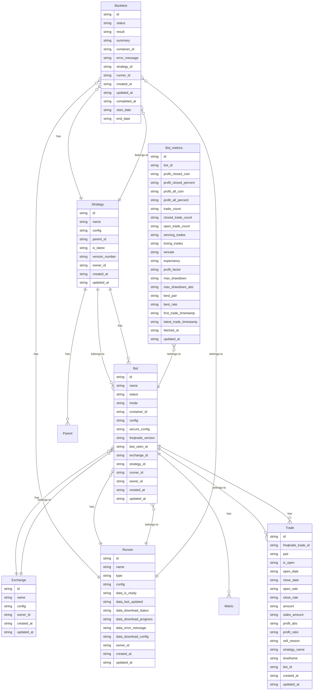

# Entity Relationship Diagram

This diagram is auto-generated from ENT schema files.
Last updated: $(date)

## Entity Descriptions

### Bot
Trading bot instance that executes a strategy on an exchange.

**Key Fields:**
- `name`: Bot name
- `mode`: Execution mode (DRY_RUN or LIVE)
- `status`: Current status (STOPPED, STARTING, RUNNING, STOPPING, FAILED)
- `container_id`: Docker container ID
- `resource_id`: Keycloak UMA resource ID for authorization

**Relationships:**
- Belongs to one Exchange
- Belongs to one Strategy
- Belongs to one Runner
- Has one BotMetrics
- Has many Trades

### Strategy
Trading strategy code and configuration. Supports immutable versioning.

**Key Fields:**
- `name`: Strategy name
- `code`: Python strategy code
- `config`: Strategy-specific configuration
- `version_number`: Version number (auto-incremented)
- `is_latest`: Whether this is the latest version
- `parent_id`: Parent version ID (for version chain)

**Relationships:**
- Has many Bots
- Has many Backtests
- Self-referential parent-child (version chain)

### Exchange
Exchange configuration and credentials.

**Key Fields:**
- `name`: Exchange name (e.g., "Binance", "Coinbase")
- `exchange_type`: Exchange type enum
- `config`: Exchange-specific configuration (API keys, etc.)
- `resource_id`: Keycloak UMA resource ID

**Relationships:**
- Has many Bots
- Has many Backtests

### Backtest
Backtest execution and results.

**Key Fields:**
- `status`: Backtest status (PENDING, RUNNING, COMPLETED, FAILED)
- `result`: Full Freqtrade backtest result JSON
- `summary`: Extracted summary with key metrics
- `container_id`: Docker container ID

**Relationships:**
- Belongs to one Strategy
- Belongs to one Exchange
- Belongs to one Runner

### Trade
Individual trade record from bot execution.

**Key Fields:**
- `pair`: Trading pair (e.g., "BTC/USDT")
- `profit_abs`: Absolute profit
- `profit_ratio`: Profit ratio
- `entry_order_status`: Entry order status
- `exit_order_status`: Exit order status

**Relationships:**
- Belongs to one Bot

### BotMetrics
Real-time metrics fetched from Freqtrade API.

**Key Fields:**
- `profit_all_coin`: Total profit in stake currency
- `profit_all_percent`: Total profit percentage
- `trade_count`: Total number of trades
- `winrate`: Win rate (0.0-1.0)
- `expectancy`: Expected profit per trade
- `max_drawdown`: Maximum drawdown

**Relationships:**
- Belongs to one Bot (one-to-one)

### Runner
Bot runner instance (Docker or Kubernetes).

**Key Fields:**
- `name`: Runner name
- `type`: Runner type (DOCKER, KUBERNETES, LOCAL)
- `endpoint`: Runner API endpoint
- `capacity`: Maximum bots this runner can handle

**Relationships:**
- Has many Bots
- Has many Backtests

## Notes

- All entities have standard fields: `id` (UUID), `created_at`, `updated_at`
- Strategy versioning uses parent-child relationships for version chains
- Keycloak UMA integration provides resource-based authorization
- Bot metrics are fetched periodically from Freqtrade API and stored separately
