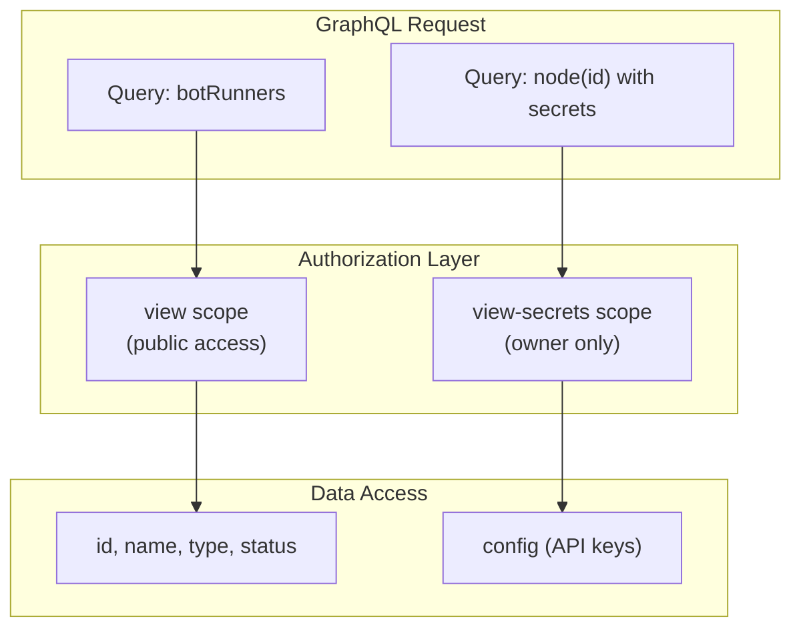
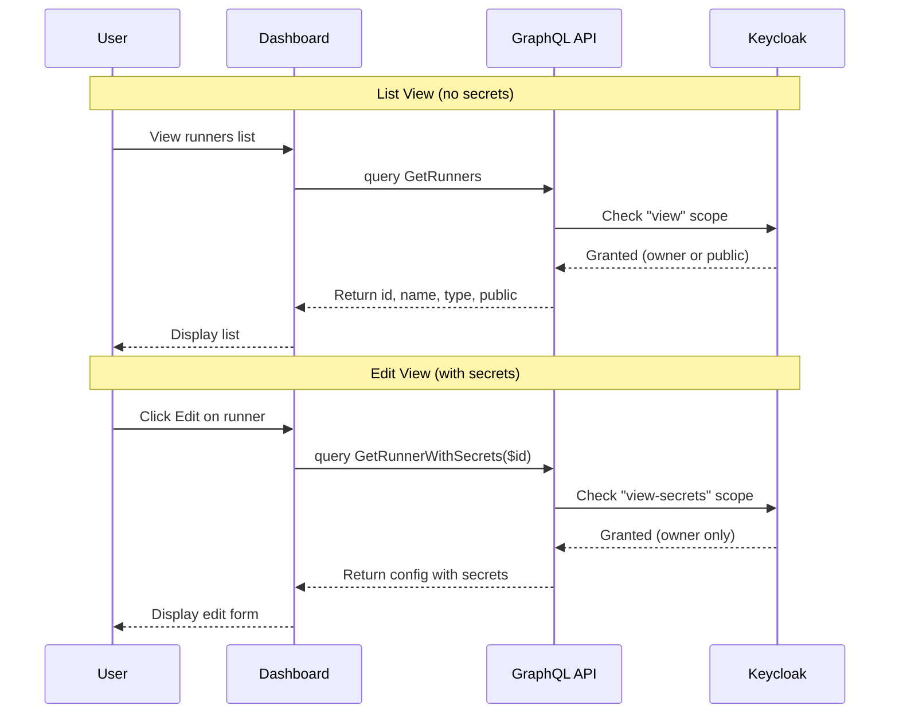

# Field-Level Authorization Pattern

This pattern describes how to implement field-level authorization using ENT schema annotations and GraphQL directives to protect sensitive data while allowing public resource sharing.

## Problem

When implementing public/private resource visibility, you need to:

1. Allow users to share resources publicly for viewing
2. Protect sensitive fields (API keys, credentials) even on public resources
3. Avoid fetching sensitive data when not needed
4. Maintain clean separation between "can view resource" and "can view secrets"

## Solution

Use a two-tier scope system with ENT schema annotations:



## Implementation

### 1. Define Scopes in authz Package

```go
// internal/authz/scopes.go
var BotRunnerScopes = []string{
    "view",         // Basic resource visibility
    "view-secrets", // Sensitive config access
    "edit",
    "delete",
}
```

### 2. Add ENT Schema Annotation

```go
// internal/ent/schema/bot_runner.go
func (BotRunner) Fields() []ent.Field {
    return []ent.Field{
        // Public fields - require only "view" scope
        field.String("name"),
        field.Enum("type").Values("docker", "kubernetes"),
        field.Bool("public").Default(false),

        // Protected field - requires "view-secrets" scope
        field.JSON("config", map[string]interface{}{}).
            Annotations(
                entgql.RequiresPermission(entgql.PermConfig{
                    Scope: "view-secrets",
                }),
            ),
    }
}
```

### 3. Split GraphQL Queries in Dashboard

```graphql
# List view - no secrets fetched
query GetRunners {
    botRunners {
        edges {
            node {
                id
                name
                type
                public
                # config NOT included
            }
        }
    }
}

# Edit view - fetch secrets only when needed
query GetRunnerWithSecrets($id: ID!) {
    node(id: $id) {
        ... on BotRunner {
            id
            name
            config           # Requires view-secrets
            dataDownloadConfig
        }
    }
}
```

### 4. Use Lazy Loading in React Components

```typescript
// dashboard/src/components/Runners/RunnersList.tsx
import { useLazyQuery } from '@apollo/client';

function RunnersList() {
    // List query - no secrets
    const { data } = useQuery(GET_RUNNERS);

    // Secrets query - only called when editing
    const [fetchSecrets] = useLazyQuery(GET_RUNNER_WITH_SECRETS);

    const handleEdit = (runner: Runner) => {
        // Only fetch secrets when user clicks edit
        fetchSecrets({ variables: { id: runner.id } });
    };

    return (
        <List>
            {data.botRunners.edges.map(({ node }) => (
                <RunnerItem
                    key={node.id}
                    runner={node}
                    onEdit={() => handleEdit(node)}
                />
            ))}
        </List>
    );
}
```

### 5. Reusable Selector Component

```typescript
// dashboard/src/components/shared/RunnerSelector.tsx
interface RunnerSelectorProps {
    value: string;
    onChange: (id: string) => void;
    dataReadyOnly?: boolean;  // Filter to data-ready runners
}

function RunnerSelector({ value, onChange, dataReadyOnly }: RunnerSelectorProps) {
    const { keycloak } = useKeycloak();
    const [showPublic, setShowPublic] = useState(true);

    // Query both own and public runners
    const { data } = useQuery(GET_RUNNERS_FOR_SELECTOR, {
        variables: { ownerID: keycloak.subject },
    });

    // Merge and deduplicate runners
    const runners = useMemo(() => {
        const myRunners = data?.myRunners?.edges || [];
        const publicRunners = data?.publicRunners?.edges || [];

        const merged = new Map();
        myRunners.forEach(({ node }) => merged.set(node.id, node));

        if (showPublic) {
            publicRunners.forEach(({ node }) => {
                if (!merged.has(node.id)) {
                    merged.set(node.id, node);
                }
            });
        }

        return Array.from(merged.values())
            .filter(r => !dataReadyOnly || r.dataIsReady);
    }, [data, showPublic, dataReadyOnly]);

    return (
        <FormControl>
            <Box display="flex" justifyContent="space-between">
                <InputLabel>Runner</InputLabel>
                <FormControlLabel
                    control={
                        <Switch
                            checked={showPublic}
                            onChange={(e) => setShowPublic(e.target.checked)}
                        />
                    }
                    label="Show public"
                />
            </Box>
            <Select value={value} onChange={(e) => onChange(e.target.value)}>
                {runners.map((runner) => (
                    <MenuItem key={runner.id} value={runner.id}>
                        {runner.name}
                        {runner.public && <Chip label="Public" size="small" />}
                    </MenuItem>
                ))}
            </Select>
        </FormControl>
    );
}
```

## Flow Diagram



## Benefits

1. **Security by Default**: Sensitive fields require explicit scope
2. **Performance**: List views don't fetch unnecessary data
3. **Granular Control**: Share resources without exposing credentials
4. **Clean Separation**: "Can view" vs "can view secrets" clearly distinguished
5. **Reusable Pattern**: Same approach for Bot, Exchange, BotRunner

## Trade-offs

1. **Query Complexity**: Need separate queries for list vs detail views
2. **Two-Step Loading**: Edit forms require additional query
3. **Schema Annotations**: Must remember to annotate sensitive fields
4. **Scope Management**: Additional scope to manage in Keycloak

## Related Patterns

- [Dependency Injection](dependency-injection.md) - How UMA client is injected
- [ENT ORM Integration](ent-orm-integration.md) - Schema annotation system
- [GraphQL Code Generation](graphql-codegen.md) - Query/mutation generation

## Related ADRs

- [ADR-0008: Multi-Tenant Authorization](../adr/0008-multi-tenant-authorization.md)

## Implementation Files

- `internal/authz/scopes.go` - Scope definitions
- `internal/ent/schema/*.go` - ENT schemas with annotations
- `dashboard/src/components/shared/RunnerSelector.tsx` - Reusable selector
- `dashboard/src/graphql/shared.graphql` - Shared queries